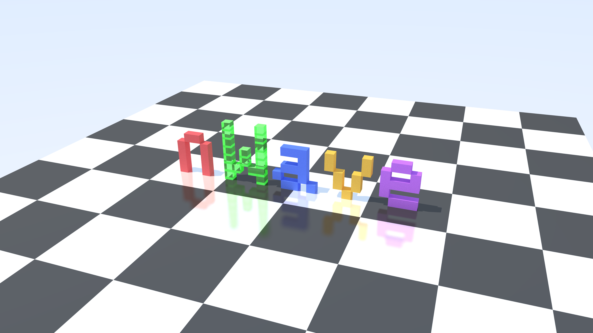

# nwave-raytracer

A Whitted-style recursive ray tracer written in C++17, built from scratch using the [nWave](https://nwave.ai) methodology (Research → Discuss → Design → Deliver).



## Features

- **Geometric primitives**: Sphere, Plane, Triangle, TriangleMesh (smooth shading), Box (slab method), Cylinder
- **Materials**: Lambertian (diffuse), Metal (mirror/fuzzy reflections), Dielectric (glass with Snell's law, Schlick's Fresnel, total internal reflection), Emissive (self-illuminating)
- **Lighting**: Point lights with shadow rays
- **Camera**: Configurable lookfrom/lookat/vup/vfov pinhole camera
- **Anti-aliasing**: Multi-sample per pixel with random sub-pixel jitter
- **Multi-threaded rendering**: Automatic scanline parallelization across all CPU cores
- **Gamma correction**: Gamma 2.0 (sqrt) applied to output
- **Output**: PPM image format

## Architecture

Clean Architecture with 4 concentric rings — dependencies point strictly inward:

```
Ring 1 (Core/Math)    → Vec3, Ray, AABB, math utilities
Ring 2 (Domain)       → Shapes, Materials, Lights, Camera, Scene
Ring 3 (Application)  → Renderer, RenderSettings
Ring 4 (Infrastructure) → PPM writer, main
```

## Build

Requires CMake 3.14+ and a C++17 compiler.

```bash
cmake -S . -B build
cmake --build build
```

## Run

```bash
./build/src/nwave
```

Produces `nwave_scene.ppm` — a 3D "nWave" logo on a reflective chessboard.

## Test

143 tests using GoogleTest (fetched automatically via CMake FetchContent).

```bash
./build/tests/nwave_tests
```

## nWave Methodology

This project was built following the nWave workflow:

1. **Research** — 52-source comprehensive study of ray tracing fundamentals, intersection algorithms, material models, and acceleration structures
2. **Discuss** — Requirements gathering with 4 stakeholder personas, 20 user stories with BDD acceptance criteria
3. **Design** — Clean Architecture with C4 diagrams, technology stack selection, component boundaries
4. **Deliver** — TDD implementation (Red-Green-Refactor) across 24 roadmap steps with automated quality gates

## License

MIT
