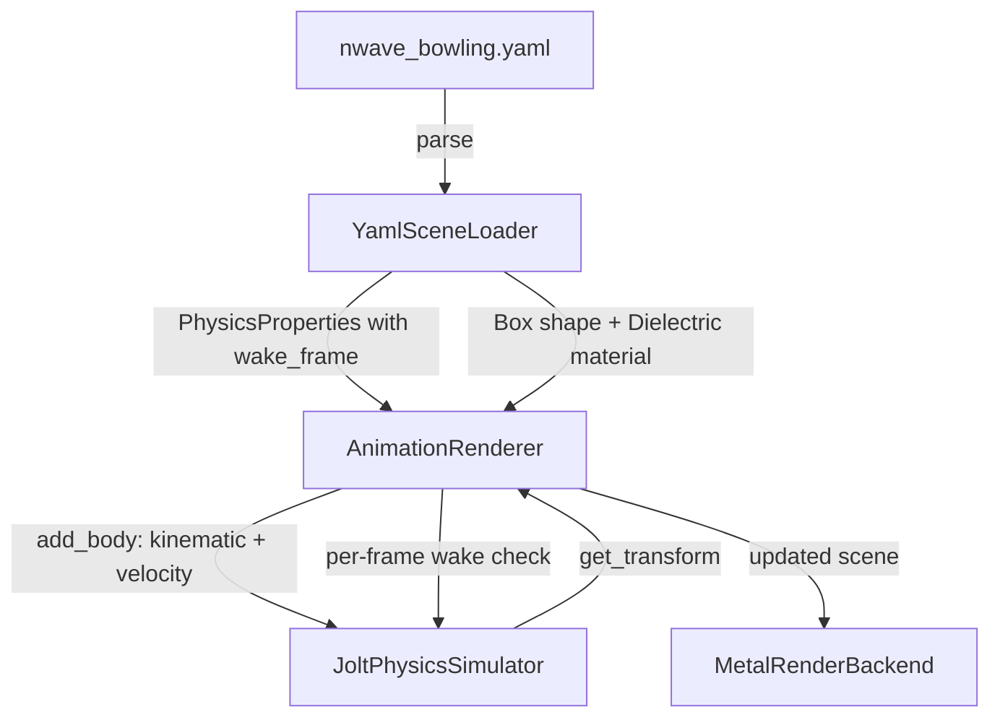

# Glass Sweeper Prism -- Architecture Design

## System Context

The nWave ray tracer renders physics-driven animations. The existing pipeline loads a YAML scene definition, creates physics bodies in Jolt Physics, steps the simulation per-frame, updates shape transforms, and renders each frame via Metal GPU compute shaders.

The glass sweeper prism adds a kinematic physics body that moves at constant velocity, pushing dynamic objects off the chessboard. This feature requires two targeted code changes and YAML content additions. No new components, no new dependencies.

## How the Feature Fits Existing Architecture

```
Core (vec3, quaternion, matrix4x4)
  |
Domain (PhysicsProperties, AnimationConfig, shapes, materials)
  |
Application (AnimationRenderer, PhysicsSimulator port)
  |
Infrastructure (JoltPhysicsSimulator, YamlSceneLoader, MetalRenderBackend)
```

**Layers touched by this feature:**

| Layer | File | Change |
|-------|------|--------|
| Domain | `physics_properties.h` | Add `wake_frame` field |
| Application | `animation_renderer.cpp` | Per-body wake check in render loop |
| Infrastructure | `jolt_physics_simulator.cpp` | Apply velocity to kinematic bodies |
| Infrastructure | `yaml_scene_loader.cpp` | Parse `wake_frame` from YAML |
| Content | `nwave_bowling.yaml` | Add material, sweeper object, timing |

**Layers NOT touched:**

| Layer | Reason |
|-------|--------|
| Core | No new math primitives needed |
| Domain/shapes | Box shape already exists |
| Domain/materials | Dielectric already supports tint |
| GPU shaders | Dielectric rendering already works |
| BVH/scene flattener | Already handles boxes |
| Metal render backend | No changes needed |

## Component Interaction



## Key Design Decisions

### Decision 1: Extend `initial_velocity` to kinematic bodies (not new API)

**Context**: Kinematic bodies need to move at constant velocity. The `initial_velocity` field already exists in `PhysicsProperties` and is parsed from YAML. Currently only applied to dynamic bodies at line 225 of `jolt_physics_simulator.cpp`.

**Decision**: Widen the condition at line 225 to include `BodyType::KINEMATIC`. No new API method needed.

**Alternatives rejected**:
- New `set_linear_velocity(body_id, vec3)` method on `PhysicsSimulator` port: Unnecessary complexity. The sweeper's velocity is constant and known at creation time. A per-frame velocity setter would be needed only for accelerating/decelerating kinematic bodies, which is not required.
- Velocity set post-creation via `BodyInterface::SetLinearVelocity`: Same effect as setting `mLinearVelocity` at creation, but requires storing body_id-to-JoltBodyID mapping for post-creation access. More complex for identical result.

**Consequences**: Minimal change (one `if` condition widened). Existing dynamic body behavior unchanged.

### Decision 2: Per-body `wake_frame` in PhysicsProperties (not AnimationConfig)

**Context**: The sweeper must start asleep and wake at frame 60, independent of the global `wake_frame: 20` that wakes letter blocks. The global mechanism wakes ALL sleeping bodies at once.

**Decision**: Add `std::optional<int> wake_frame` to `PhysicsProperties`. The animation renderer checks each body's per-object `wake_frame` during the render loop, alongside the existing global wake check.

**Alternatives rejected**:
- Multiple global wake frames (list in AnimationConfig): Wakes all bodies at each listed frame. Cannot target individual bodies. The sweeper must wake while letter blocks remain asleep (already woken earlier).
- Named wake groups: Over-engineered for one sweeper. Would require group assignment in YAML and group-based activation logic. Only one delayed-wake object exists in this scene.

**Consequences**: Per-body granularity. Backward compatible (field is optional, default nullopt). Existing global wake_frame continues to work for ungrouped bodies.

### Decision 3: Sweeper as kinematic body (not animated transform)

**Context**: The sweeper must move at constant velocity AND collide with/push dynamic objects.

**Decision**: Use Jolt's kinematic body type. Kinematic bodies participate in collision detection and push dynamic bodies, but are not affected by forces or collisions themselves.

**Alternatives rejected**:
- Pure transform animation (translate box each frame without physics): No collision detection. Dynamic objects would not be pushed. Defeats the purpose.
- Dynamic body with very high mass: Would be affected by gravity (need workaround), could be deflected by heavy bowling ball (6kg), and velocity would not remain perfectly constant.

**Consequences**: Jolt handles collision response automatically. Sweeper maintains exact constant velocity regardless of what it contacts.

## Integration Points

1. **YAML -> PhysicsProperties**: `parse_physics()` reads `wake_frame` field, stores in `PhysicsProperties.wake_frame`.
2. **PhysicsProperties -> JoltPhysicsSimulator**: `add_body()` applies `initial_velocity` to both DYNAMIC and KINEMATIC bodies. Bodies with `start_asleep: true` are created with `DontActivate`.
3. **AnimationRenderer render loop**: Each frame, checks if any body's per-object `wake_frame` matches the current frame. If so, activates that specific body via `PhysicsSimulator`.
4. **PhysicsSimulator port**: May need a `wake_body(int body_id)` method to activate individual bodies (current `wake_all()` is too broad for per-body control).

## Risk: Chessboard Collision

The sweeper base is at Y=0, same as the chessboard tile surface (max_y=0.0). Since the sweeper is kinematic (LAYER_DYNAMIC) and chessboard tiles default to static (LAYER_STATIC), the `ObjectLayerPairFilter` allows dynamic-static collisions. The sweeper could collide with the board surface.

**Mitigation**: Position the sweeper base slightly above the board surface (e.g., `min_y: 0.01`). This 0.01-unit gap is invisible at render resolution but prevents physics collision with the board. This is a YAML tuning concern (US-005), not a code change.

## Risk: Static Letter Pass-Through

The static letters (n, a, v) have no `physics` block, so they default to `BodyType::STATIC` and are placed on `LAYER_STATIC`. The sweeper is kinematic on `LAYER_DYNAMIC`. The `ObjectLayerPairFilter::ShouldCollide` returns `false` for STATIC-vs-STATIC but `true` for DYNAMIC-vs-STATIC.

**Analysis**: The sweeper IS on LAYER_DYNAMIC (kinematic maps to LAYER_DYNAMIC at line 201). The static letters are on LAYER_STATIC. So `ShouldCollide(LAYER_DYNAMIC, LAYER_STATIC)` returns `true` -- they WILL collide.

**Mitigation options** (for US-005 tuning):
- Raise static letters above the sweeper's min_y so they don't geometrically intersect.
- Or accept that the sweeper pushes static letter geometry (they won't move because they're static, but the sweeper might judder). Since kinematic bodies are not affected by collision response, the sweeper will pass through static bodies without being deflected. Jolt resolves kinematic-static overlap by pushing neither body. This is the expected and correct behavior.
