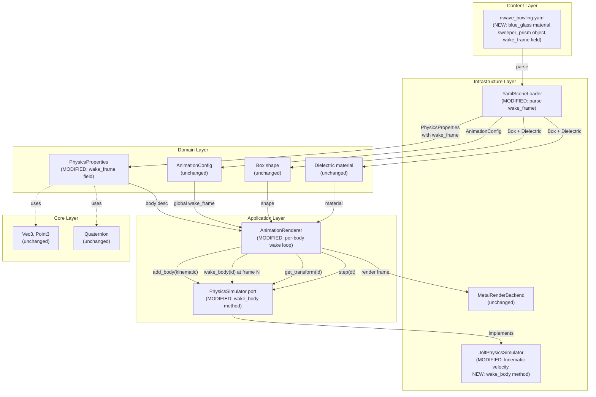
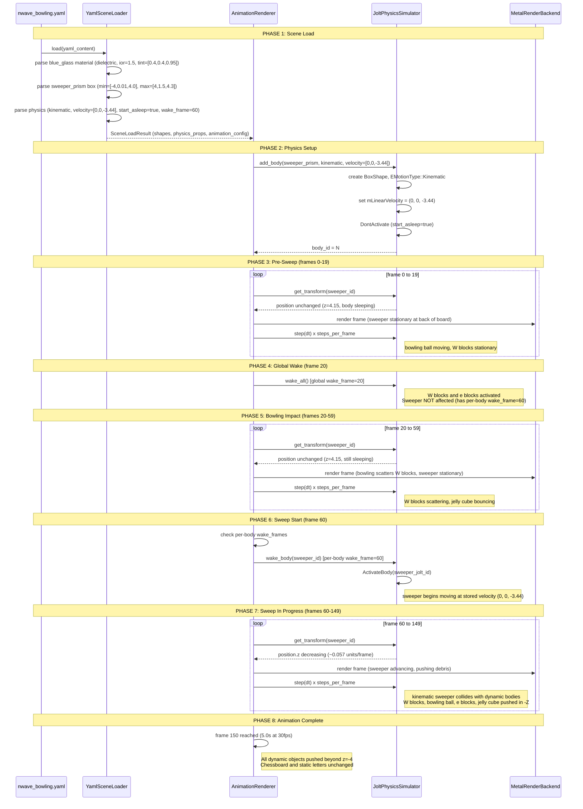
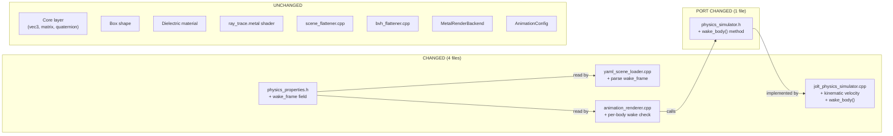

# Glass Sweeper Prism -- C4 Component Diagrams

## 1. Component Diagram: Data Flow

Shows how the sweeper prism data flows from YAML through the architecture layers to rendered output. Modified components are marked with `(MODIFIED)`. New data paths are marked with `(NEW)`.

## 2. Sequence Diagram: Sweep Animation Lifecycle

Shows the frame-by-frame lifecycle from scene load through sweep completion. Key phases: setup, pre-sweep (bowling impact), sweep start, sweep in progress, sweep complete.

## 3. Component Boundary Diagram: What Changes vs What Does Not

