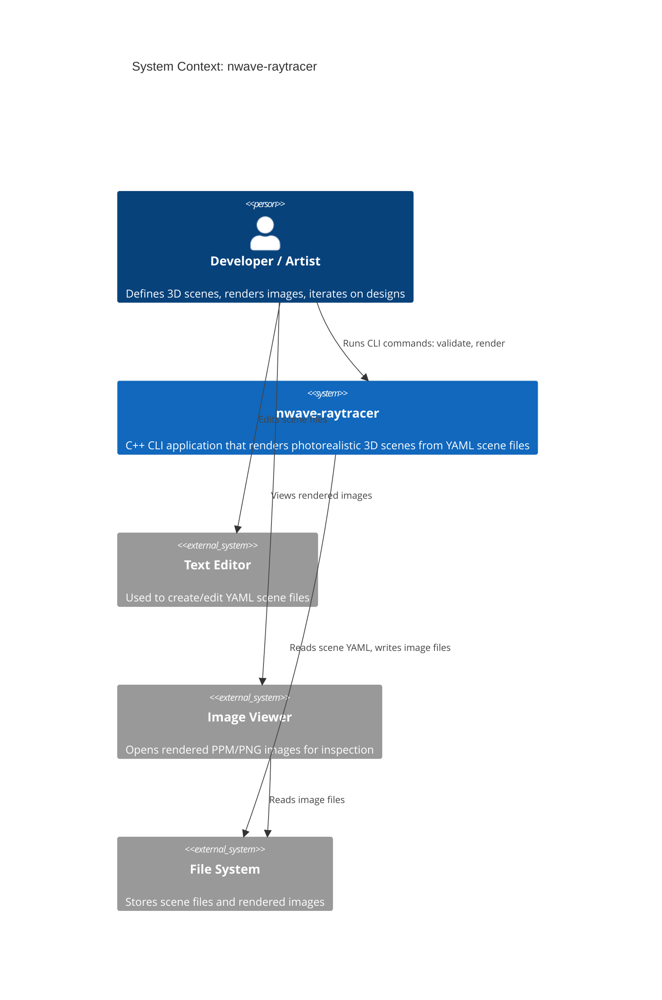
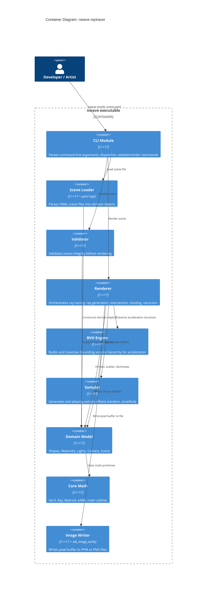
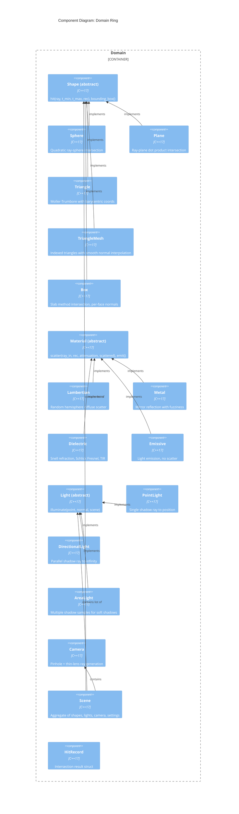

# nwave-raytracer -- Architecture Design

**Document ID**: ARCH-RAYTRACER-001
**Date**: 2026-02-16
**Status**: Draft
**Architecture Style**: Clean Architecture (concentric dependency rings)
**Rendering Model**: Whitted-style recursive ray tracing

---

## 1. System Overview

nwave-raytracer is a C++17 CLI application that renders photorealistic 3D scenes. Users define scenes via YAML files, invoke a single executable, and receive image output (PPM or PNG). The system traces rays from a virtual camera through each pixel, computing intersections with geometry, evaluating material interactions, and recursively following reflected/refracted rays to produce the final color.

### 1.1 Business Capabilities

| Capability | Description | Stakeholder Value |
|---|---|---|
| Scene definition | YAML-based declarative scene authoring | Fast iteration without recompilation (Elena, David) |
| Geometric rendering | Ray-primitive intersection for spheres, planes, triangles, boxes, meshes | Visual variety and creative flexibility (David, Sofia) |
| Material simulation | Diffuse, metallic, and dielectric materials with physically-based behavior | Photorealistic appearance (David, Sofia) |
| Lighting and shadows | Point, directional, and area lights with hard/soft shadows | Depth and realism in rendered images (all stakeholders) |
| Camera control | Pinhole and thin-lens models with configurable position, FOV, depth of field | Artistic control over framing and focus (Sofia) |
| Anti-aliasing | Random supersampling and stratified sampling | Professional image quality (Sofia, Elena) |
| Acceleration | BVH spatial partitioning for O(log n) intersection | Feasible render times on complex scenes (Sofia) |
| Image output | PPM and PNG export with gamma correction and tone mapping | Universal image viewing and sharing (all stakeholders) |

### 1.2 Quality Attributes (ISO 25010)

| Attribute | Target | Strategy |
|---|---|---|
| **Performance** | Walking skeleton: <1s; 100 spheres at 10 SPP 800x450: <30s | BVH acceleration; potential OpenMP parallelization of pixel loop |
| **Correctness** | Pixel-identical BVH vs brute-force; visually matches Shirley reference scenes | Unit-tested intersection math; reference image comparison |
| **Maintainability** | New primitive or material requires zero changes to renderer or other types | Clean Architecture dependency rule; polymorphic interfaces |
| **Portability** | Linux, macOS, Windows | C++17 standard; CMake build; no platform-specific APIs in core |
| **Usability** | Clear error messages; progress bar during render; CLI flag overrides for iteration | Validation before render; actionable error messages with context |
| **Reliability** | No NaN propagation; no stack overflow on deep recursion; graceful handling of edge cases | NaN guards; max recursion depth; epsilon offsets; degenerate input checks |

---

## 2. Clean Architecture Ring Model

The system follows Clean Architecture with four concentric rings. Dependencies point inward only -- outer rings depend on inner rings, never the reverse. Each ring boundary is enforced by the directory/namespace structure and compilation unit dependencies.

```
+---------------------------------------------------------------+
|                     Infrastructure (Ring 4)                     |
|   CLI  |  SceneLoader  |  ImageWriter  |  Validator            |
|   +-----------------------------------------------------------+|
|   |                  Application (Ring 3)                      ||
|   |   Renderer  |  BVH  |  Sampler                            ||
|   |   +-------------------------------------------------+     ||
|   |   |              Domain (Ring 2)                     |     ||
|   |   |  Shape  |  Material  |  Light  |  Camera  |  Scene|    ||
|   |   |   +-------------------------------------------+  |    ||
|   |   |   |          Core / Math (Ring 1)             |  |    ||
|   |   |   |  Vec3 | Point3 | Color3 | Ray | Matrix4  |  |    ||
|   |   |   |  AABB | MathUtils                         |  |    ||
|   |   |   +-------------------------------------------+  |    ||
|   |   +-------------------------------------------------+     ||
|   +-----------------------------------------------------------+|
+---------------------------------------------------------------+
```

### 2.1 Ring 1: Core / Math (Innermost)

**Responsibility**: Mathematical primitives with zero external dependencies. These are value types used throughout the system.

**Contents**: Vec3, Point3, Color3, Ray, Matrix4x4, AABB, math utility functions (random, constants, clamp, epsilon).

**Dependency rule**: Depends on nothing except the C++ standard library.

**Rationale**: Isolating math types means they can be tested in complete isolation and reused without pulling in any rendering-specific concepts.

### 2.2 Ring 2: Domain

**Responsibility**: The domain model of a ray-traced scene -- geometry, materials, lights, camera, and scene composition. These types encode the domain rules (how shapes intersect, how materials scatter, how lights illuminate) but know nothing about rendering orchestration, file I/O, or CLI.

**Contents**:
- **Shape hierarchy**: Abstract `Shape` base class; concrete types Sphere, Plane, Triangle, TriangleMesh, Box, Cylinder, Cone
- **Material hierarchy**: Abstract `Material` base class; concrete types Lambertian, Metal, Dielectric, Emissive
- **Light hierarchy**: Abstract `Light` base class; concrete types PointLight, DirectionalLight, AreaLight
- **Camera**: Pinhole and thin-lens camera models
- **HitRecord**: Intersection result carrying point, normal, t, material, UV, front-face flag
- **Scene**: Aggregate of shapes, lights, camera, and render settings

**Dependency rule**: Depends only on Ring 1 (Core/Math).

**Rationale**: Domain types own the physics and geometry rules. By depending only on math primitives, they remain testable without I/O or orchestration scaffolding. Adding a new Shape subclass requires no changes to existing domain types.

### 2.3 Ring 3: Application

**Responsibility**: Use-case orchestration. The Renderer takes a Scene and produces a pixel buffer. It coordinates ray generation, BVH traversal, shading, recursion, and sampling, but has no knowledge of file formats, CLI arguments, or output destinations.

**Contents**:
- **Renderer**: Orchestrates the rendering loop (for each pixel, for each sample, generate ray, trace, shade, accumulate)
- **BVH**: Bounding Volume Hierarchy construction and traversal. Wraps Shape objects with spatial acceleration.
- **Sampler**: Anti-aliasing sampling strategies (random supersampling, stratified/jittered)

**Dependency rule**: Depends on Ring 2 (Domain) and Ring 1 (Core/Math). Does not depend on Ring 4 (Infrastructure).

**Rationale**: The rendering algorithm operates on abstract domain interfaces (Shape::hit, Material::scatter, Light::illuminate). It produces a pixel buffer (2D array of Color3) and has no opinion about how that buffer is written to disk or where the Scene came from. This makes the renderer testable with programmatically constructed scenes and inspectable pixel buffers.

### 2.4 Ring 4: Infrastructure (Outermost)

**Responsibility**: Adapters to the external world -- file I/O, CLI parsing, scene file loading, image writing, and validation.

**Contents**:
- **CLI**: Command-line argument parsing (`nwave render <scene>`, `nwave validate <scene>`, flags like `--samples`, `--width`, `--output`)
- **SceneLoader**: Parses YAML files into Scene objects using yaml-cpp
- **ImageWriter**: Abstract writer interface with PPM (text/binary) and PNG (via stb_image_write) implementations
- **Validator**: Validates parsed scenes (reference integrity, parameter ranges, structural checks)

**Dependency rule**: Depends on all inner rings. This is the only ring that knows about external libraries (yaml-cpp, stb_image_write) and I/O operations.

**Rationale**: By confining all I/O to the outermost ring, the core rendering system remains portable and testable. Swapping YAML for JSON requires changing only SceneLoader. Adding a new image format requires only a new ImageWriter implementation.

---

## 3. Component Descriptions

### 3.1 Core / Math Components

| Component | Responsibility |
|---|---|
| **Vec3** | 3D vector with arithmetic operators, dot, cross, normalize, length, random generation |
| **Point3** | Type alias or distinct type for 3D spatial positions (same storage as Vec3) |
| **Color3** | Type alias or distinct type for RGB color values (same storage as Vec3, range [0,1] per channel) |
| **Ray** | Origin (Point3) + direction (Vec3); provides `at(t)` to compute point along ray |
| **Matrix4x4** | 4x4 homogeneous transformation matrix for translate, rotate, scale; inverse and inverse-transpose operations |
| **AABB** | Axis-aligned bounding box (min/max corners); ray-AABB intersection via slab method; merge operation for BVH construction |
| **MathUtils** | Constants (pi, epsilon, infinity), clamp, degrees-to-radians, random double generators |

### 3.2 Domain Components

| Component | Responsibility |
|---|---|
| **Shape (abstract)** | Defines `hit(ray, t_min, t_max, hit_record)` and `bounding_box()` interface |
| **Sphere** | Center + radius; quadratic ray-sphere intersection; outward normal at hit point |
| **Plane** | Point + normal; ray-plane intersection; constant normal |
| **Triangle** | 3 vertices; Moller-Trumbore intersection; barycentric coordinates; face normal |
| **TriangleMesh** | Vertex + normal + index arrays; per-triangle Moller-Trumbore; barycentric normal interpolation |
| **Box** | Min/max corners; slab method intersection; per-face normal determination |
| **Material (abstract)** | Defines `scatter(ray_in, hit_record, attenuation, scattered_ray)` and optional `emit()` |
| **Lambertian** | Diffuse scatter: random hemisphere direction weighted by albedo |
| **Metal** | Mirror reflection with optional fuzziness perturbation; albedo-tinted attenuation |
| **Dielectric** | Snell's law refraction; Schlick's Fresnel approximation; total internal reflection handling |
| **Emissive** | Emits light; does not scatter. Returns emission color from `emit()` |
| **Light (abstract)** | Defines `illuminate(point, normal, scene)` returning illumination contribution and shadow ray parameters |
| **PointLight** | Position + color + intensity; single shadow ray; inverse-square falloff optional |
| **DirectionalLight** | Direction + color + intensity; shadow ray at infinity; no distance attenuation |
| **AreaLight** | Position + dimensions + orientation; multiple shadow ray samples for soft shadows |
| **Camera** | Lookfrom/lookat/vup/vfov/aspect; orthonormal basis; ray generation for pixel coordinates; thin-lens mode with aperture and focus distance |
| **HitRecord** | Struct: point, normal, t, front_face, material pointer, u/v texture coordinates |
| **Scene** | Collection of shapes, lights, camera, background; delegates hit testing to shape list or BVH |
| **RenderSettings** | image_width, image_height, samples_per_pixel, max_depth, output_filename, sampler_type |

### 3.3 Application Components

| Component | Responsibility |
|---|---|
| **Renderer** | Main rendering loop: iterates pixels, invokes sampler for sub-pixel offsets, generates camera rays, calls `trace_ray` recursively, accumulates and averages samples, applies gamma correction |
| **trace_ray** | Core recursive function: finds closest hit via scene/BVH, evaluates material scatter, recursively traces scattered ray, computes direct illumination via light list, returns accumulated color |
| **BVH** | Builds a binary tree of AABB-bounded nodes over the scene's shape list; implements Shape interface so it is transparent to the renderer; longest-axis midpoint split (initial), SAH (optimized) |
| **Sampler** | Generates sub-pixel sample offsets; RandomSampler (uniform random), StratifiedSampler (jittered grid) |

### 3.4 Infrastructure Components

| Component | Responsibility |
|---|---|
| **CLI** | Parses command-line arguments; dispatches to validate or render sub-commands; merges CLI overrides with scene file settings |
| **SceneLoader** | Reads YAML using yaml-cpp; constructs Scene, Camera, Materials, Shapes, Lights, RenderSettings; resolves material references by name |
| **Validator** | Checks scene integrity: material reference resolution, parameter range validation (FOV 1-179, SPP 1-10000, etc.), structural completeness |
| **ImageWriter (abstract)** | Defines `write(filename, pixel_buffer, width, height)` interface |
| **PPMWriter** | Writes PPM P3 (text) or P6 (binary) format |
| **PNGWriter** | Writes PNG via stb_image_write |
| **ProgressReporter** | Displays rendering progress bar with row count, elapsed time, and ETA |

---

## 4. Rendering Pipeline Data Flow

The rendering pipeline follows a linear data flow from scene loading through image output:

```
[YAML File] --> SceneLoader --> [Scene Object]
                                     |
                                     v
                              Validator --> [Validated Scene]
                                     |
                                     v
                              BVH Construction --> [BVH Tree]
                                     |
                                     v
                              Renderer Loop:
                                for each pixel (x, y):
                                  for each sample s:
                                    Sampler --> (u, v) offset
                                    Camera --> Ray
                                    trace_ray(Ray, Scene/BVH, depth=0):
                                      Shape::hit() --> HitRecord
                                      Material::scatter() --> scattered Ray + attenuation
                                      Light::illuminate() --> direct illumination
                                      recurse on scattered ray (depth+1)
                                    accumulate color
                                  average samples
                                  gamma correct
                                  store in pixel buffer
                                     |
                                     v
                              ImageWriter --> [PPM/PNG File]
```

### 4.1 Detailed trace_ray Flow

1. **Intersection**: Call `scene.hit(ray, t_min=0.001, t_max=infinity, hit_record)`. With BVH, this traverses the bounding volume hierarchy. Without BVH, this iterates all shapes.
2. **Miss**: If no hit, return background color (sky gradient or black).
3. **Recursion check**: If `depth >= max_depth`, return black.
4. **Emission**: Collect `hit_record.material->emit()` (non-zero only for Emissive materials).
5. **Scatter**: Call `hit_record.material->scatter(ray, hit_record, attenuation, scattered)`.
   - If scatter returns false, the ray is absorbed; return emission only.
   - If scatter returns true, recursively trace the scattered ray.
6. **Direct illumination**: For each light in the scene, cast a shadow ray from the hit point (offset by epsilon along normal) toward the light. If unoccluded, add the light's diffuse contribution (albedo * light_color * intensity * max(0, dot(N, L))).
7. **Combine**: Return emission + attenuation * recursive_color + direct_illumination.

### 4.2 Shadow Ray Flow

1. Compute shadow origin: `hit_point + epsilon * normal` (epsilon = 0.001).
2. For point lights: direction = normalize(light_position - shadow_origin); t_max = distance to light.
3. For directional lights: direction = -light_direction; t_max = infinity.
4. For area lights: sample random point on light surface; direction and t_max computed per sample.
5. Cast "any hit" ray (early exit on first intersection in [0, t_max]).
6. If occluded, this light contributes zero for this sample.

---

## 5. Key Architectural Decisions

### ADR-001: Clean Architecture with Four Rings

**Status**: Accepted

**Context**: The system must support incremental feature growth (20 user stories across 11 feature increments) while maintaining testability and extensibility. Each new primitive, material, or output format must integrate without modifying existing components. Prof. Tanaka requires a clean, teachable architecture.

**Decision**: Adopt Clean Architecture (Robert C. Martin) with four concentric rings: Core/Math, Domain, Application, Infrastructure. Dependencies point inward only.

**Alternatives Considered**:
- **Layered architecture (horizontal layers)**: Simpler but does not enforce the dependency inversion needed for testability. Domain objects would depend on infrastructure (e.g., Scene depends on YAML parser).
- **Microkernel/plugin architecture**: Over-engineered for a single-executable CLI tool with no runtime plugin loading requirement.

**Consequences**:
- Positive: New primitives/materials are additive (no changes to existing code). All rings are independently testable. Clear mental model for teaching.
- Negative: Requires discipline to maintain ring boundaries. Slightly more files/directories than a flat structure.

### ADR-002: Whitted-Style Recursive Ray Tracing

**Status**: Accepted

**Context**: The project needs to produce photorealistic images with reflections, refractions, and shadows. The user-selected rendering model is Whitted-style recursive ray tracing rather than full path tracing.

**Decision**: Implement Whitted-style recursive ray tracing with direct illumination, shadow rays, and recursive reflection/refraction. The Material::scatter interface allows stochastic behavior (Lambertian random scatter) while supporting deterministic paths (Metal mirror reflection, Dielectric refraction).

**Alternatives Considered**:
- **Pure path tracing (Monte Carlo)**: More physically accurate but converges slowly at low sample counts, producing noisy images. Whitted-style provides cleaner results at low SPP, matching the incremental learning journey.
- **Ray casting only (no recursion)**: Insufficient for reflections and refractions (user stories US-301, US-401 require these).

**Consequences**:
- Positive: Clean sharp reflections and refractions at low SPP. Simpler implementation progression. Matches "Ray Tracing in One Weekend" reference material.
- Negative: Soft effects (glossy reflections, area light penumbras) require multi-sampling per material interaction rather than being emergent from path tracing.

### ADR-003: BVH as Sole Acceleration Structure

**Status**: Accepted

**Context**: Scene complexity targets up to 500+ objects. Brute-force O(N) intersection per ray is unacceptable. An acceleration structure is required.

**Decision**: BVH with AABB nodes. Initial implementation uses longest-axis midpoint split. SAH optimization as future enhancement.

**Alternatives Considered**:
- **kd-tree**: Potentially faster traversal on static scenes per some benchmarks, but more complex construction, higher memory (primitive duplication), and poor dynamic scene support. BVH is the modern industry standard (NVIDIA OptiX, Intel Embree, Vulkan RT all use BVH).
- **Uniform grid**: O(1) build time but degrades to O(N) for non-uniform geometry distribution (the "teapot in a stadium" problem). Not suitable for general scenes.

**Consequences**:
- Positive: O(log N) intersection; compact memory; well-documented algorithm; BVH node implements Shape interface (transparent to renderer).
- Negative: Midpoint split is suboptimal for irregular distributions; SAH upgrade needed for best performance.

### ADR-004: YAML Scene File Format

**Status**: Accepted

**Context**: Users need to define scenes without recompiling C++ (US-901). The format must be human-readable, widely known, and parseable with a well-maintained library.

**Decision**: YAML scene file format, parsed with yaml-cpp.

**Alternatives Considered**:
- **JSON**: Equally well-supported but more verbose and less human-friendly (no comments, required quotes on keys). YAML is a superset of JSON, so JSON files are valid YAML.
- **Custom DSL** (like POV-Ray): Maximum expressiveness but requires building a parser from scratch, which is not core to the ray tracing domain.

**Consequences**:
- Positive: Familiar format for developers; supports comments; concise syntax; yaml-cpp is well-maintained (MIT license).
- Negative: YAML has parsing gotchas (indentation sensitivity, implicit type coercion). Mitigated by strict validation (Validator component).

### ADR-005: Object-Oriented Polymorphic Hierarchies

**Status**: Accepted

**Context**: The user selected an OO hierarchy for the data model. Shapes, Materials, and Lights each need a common interface with type-specific behavior.

**Decision**: Abstract base classes with pure virtual methods. Shape defines `hit()` and `bounding_box()`. Material defines `scatter()` and `emit()`. Light defines `illuminate()`. Concrete types inherit and implement.

**Alternatives Considered**:
- **std::variant + visitor pattern**: Better cache performance for small type sets, but becomes unwieldy as the number of types grows (7 shapes, 4 materials, 3 lights = 14 types). Adding a new type requires modifying the variant definition and all visitors.
- **Entity-Component System (ECS)**: Over-engineered for the number of entities and component types in a ray tracer. ECS excels with thousands of entities and frequent composition changes, neither of which applies here.

**Consequences**:
- Positive: Adding a new Shape/Material/Light subclass requires only the new class file -- zero changes to existing code. The renderer works against abstract interfaces. Familiar OOP pattern for teaching (Prof. Tanaka).
- Negative: Virtual dispatch overhead per intersection test (mitigated by BVH reducing total intersection calls). Heap allocation for polymorphic objects (mitigated by pre-allocated scene construction).

---

## 6. Deployment Architecture

The system deploys as a single statically-linked executable. No runtime dependencies beyond the OS.

```
+------------------------------------+
|  nwave (single executable)          |
|                                    |
|  Statically links:                 |
|  - yaml-cpp (YAML parsing)        |
|  - stb_image_write (PNG output)   |
|  - GoogleTest (test binary only)   |
|                                    |
|  Reads: scene.yaml                 |
|  Writes: output.ppm / output.png  |
+------------------------------------+
```

### Build Configuration

- **Build system**: CMake 3.16+
- **Compiler**: Any C++17-compliant compiler (GCC 7+, Clang 5+, MSVC 19.14+)
- **Targets**:
  - `nwave` -- the main executable
  - `nwave_tests` -- unit and integration test executable (links GoogleTest)
- **Third-party management**: CMake FetchContent for yaml-cpp and GoogleTest; stb_image_write vendored as a single header in `third_party/`

---

## 7. C4 Architecture Diagrams

### 7.1 C4 Context Diagram



### 7.2 C4 Container Diagram



### 7.3 C4 Component Diagram (Domain Ring)



---

## 8. Cross-Cutting Concerns

### 8.1 Error Handling

- **Scene loading errors**: Reported with file name, line number (when available from yaml-cpp), field name, and available alternatives. Process exits with non-zero status.
- **Validation errors**: Collected and reported as a checklist (OK/FAIL per category) before rendering begins. No render time wasted on invalid scenes.
- **Runtime numerical errors**: NaN guards on all color outputs (`if (value != value) value = 0`). Degenerate scatter directions (near-zero) are replaced with surface normal. Epsilon offsets prevent self-intersection.

### 8.2 Testing Strategy

| Layer | Test Type | Example |
|---|---|---|
| Core/Math | Unit tests | Vec3 arithmetic, Ray::at(t), AABB intersection |
| Domain | Unit tests | Sphere::hit with known ray configurations; Material::scatter direction distribution |
| Application | Integration tests | Render a 2-object scene and verify specific pixel colors; BVH vs brute-force pixel-identity |
| Infrastructure | Integration tests | Parse a YAML file and verify the constructed Scene; write PPM and verify file structure |
| End-to-end | System tests | Render reference scenes (Cornell Box, Shirley's random spheres) and compare against known-good images |

### 8.3 Performance Strategy

1. **BVH acceleration**: Primary performance strategy. Reduces O(N) to O(log N) intersection tests per ray.
2. **Early exit for shadow rays**: Shadow ray testing uses "any hit" (returns true on first intersection) rather than "closest hit".
3. **Potential OpenMP parallelization**: Each pixel is independent. The outer pixel loop can be parallelized with `#pragma omp parallel for` on the row loop. Not in initial implementation but architecturally supported (no shared mutable state in the rendering loop).
4. **Double precision**: Use `double` throughout for intersection math to minimize numerical artifacts. This is a correctness-over-speed tradeoff appropriate for a CPU ray tracer.

---

## 9. Traceability Matrix

| Requirement Area | Architecture Component | Ring |
|---|---|---|
| Walking skeleton (US-000) | All components (minimal slice) | 1-4 |
| Geometric primitives (US-101, 102, 103) | Shape hierarchy (Sphere, Plane, Triangle, Mesh, Box) | 2 |
| Multiple lights (US-201, 202) | Light hierarchy (PointLight, DirectionalLight) | 2 |
| Hard shadows (US-203) | trace_ray shadow ray logic | 3 |
| Metal material (US-301, 302) | Metal material class | 2 |
| Glass material (US-401, 402) | Dielectric material class | 2 |
| Recursive reflection (US-501) | trace_ray depth tracking | 3 |
| Configurable camera (US-601) | Camera class | 2 |
| Depth of field (US-602) | Camera thin-lens mode | 2 |
| Anti-aliasing (US-701, 702) | Sampler (Random, Stratified) | 3 |
| BVH acceleration (US-801) | BVH class | 3 |
| YAML scene loading (US-901) | SceneLoader, Validator | 4 |
| Area lights (US-1001) | AreaLight class | 2 |
| Gamma/tone mapping (US-1002) | Renderer (post-processing step) | 3 |
| Image output (PPM/PNG) | ImageWriter (PPMWriter, PNGWriter) | 4 |
| CLI and progress (UX Journey) | CLI, ProgressReporter | 4 |

---

## 10. Handoff Notes for Acceptance Designer

This architecture document, together with the companion documents (technology-stack.md, component-boundaries.md, data-models.md, diagrams/), provides the technical foundation for the DISTILL wave. Key items for the acceptance designer:

1. **20 user stories are READY** per the DoR checklist. The recommended implementation order (from dor-checklist.md) groups them into 9 phases from walking skeleton through polish.
2. **Ring boundaries** define where each story's implementation lives. The crafter should verify dependency direction at every step.
3. **Key interfaces** (Shape, Material, Light) are the extension points. Each new type is additive.
4. **Testing strategy** maps to the ring model: unit tests per ring, integration tests at ring boundaries, system tests for end-to-end validation.
5. **Performance targets** are specified in requirements.md Section 5.1 and should be acceptance-tested with timing assertions.
