# C4 Component Diagram: Domain Ring

## Diagram

```mermaid
graph TB
    subgraph domain ["Domain Ring (Ring 2)"]
        direction TB

        shape["<b>Shape</b><br/><i>abstract base class</i><br/>hit(ray, t_min, t_max, rec)<br/>bounding_box()"]

        sphere["<b>Sphere</b><br/>center, radius<br/>Quadratic intersection"]
        plane["<b>Plane</b><br/>point, normal<br/>Dot-product intersection"]
        triangle["<b>Triangle</b><br/>v0, v1, v2<br/>Moller-Trumbore"]
        mesh["<b>TriangleMesh</b><br/>vertices, normals, indices<br/>Smooth normal interpolation"]
        box["<b>Box</b><br/>min, max corners<br/>Slab method intersection"]

        material["<b>Material</b><br/><i>abstract base class</i><br/>scatter(ray_in, rec, atten, scattered)<br/>emit(u, v, point)"]

        lambertian["<b>Lambertian</b><br/>albedo<br/>Random hemisphere scatter"]
        metal["<b>Metal</b><br/>albedo, fuzziness<br/>Mirror reflection + perturbation"]
        dielectric["<b>Dielectric</b><br/>IOR<br/>Snell + Schlick + TIR"]
        emissive["<b>Emissive</b><br/>color, intensity<br/>No scatter, emits light"]

        light["<b>Light</b><br/><i>abstract base class</i><br/>illuminate(point)<br/>shadow_sample_count()"]

        pointlight["<b>PointLight</b><br/>position, color, intensity<br/>Single shadow ray"]
        dirlight["<b>DirectionalLight</b><br/>direction, color, intensity<br/>Parallel shadow rays, t_max=inf"]
        arealight["<b>AreaLight</b><br/>position, u_axis, v_axis<br/>Multi-sample soft shadows"]

        camera["<b>Camera</b><br/>lookfrom, lookat, vup, vfov<br/>aperture, focus_distance<br/>generate_ray(u, v)"]

        hitrec["<b>HitRecord</b><br/>point, normal, t, u, v<br/>front_face, material ptr"]

        scene["<b>Scene</b><br/>shapes, lights, camera<br/>settings, background"]
    end

    subgraph core ["Core Ring (Ring 1)"]
        vec3["<b>Vec3 / Point3 / Color3</b>"]
        ray["<b>Ray</b>"]
        aabb["<b>AABB</b>"]
    end

    sphere -->|"implements"| shape
    plane -->|"implements"| shape
    triangle -->|"implements"| shape
    mesh -->|"implements"| shape
    box -->|"implements"| shape

    lambertian -->|"implements"| material
    metal -->|"implements"| material
    dielectric -->|"implements"| material
    emissive -->|"implements"| material

    pointlight -->|"implements"| light
    dirlight -->|"implements"| light
    arealight -->|"implements"| light

    scene -->|"contains"| shape
    scene -->|"contains"| light
    scene -->|"contains"| camera
    hitrec -->|"references"| material

    shape -->|"uses"| ray
    shape -->|"uses"| aabb
    shape -->|"uses"| vec3
    material -->|"uses"| ray
    material -->|"uses"| vec3
    light -->|"uses"| vec3
    camera -->|"uses"| ray
    camera -->|"uses"| vec3
    hitrec -->|"uses"| vec3

    classDef abstract fill:#E8D44D,stroke:#C9B72C,color:#000
    classDef concrete fill:#438DD5,stroke:#3C7FC0,color:#fff
    classDef struct fill:#85BBF0,stroke:#6FA8DC,color:#000
    classDef core fill:#F0F0F0,stroke:#CCCCCC,color:#000

    class shape,material,light abstract
    class sphere,plane,triangle,mesh,box,lambertian,metal,dielectric,emissive,pointlight,dirlight,arealight,camera concrete
    class hitrec,scene struct
    class vec3,ray,aabb core
```

## Component Relationships

### Shape Hierarchy

- All shapes implement the `Shape` abstract interface
- Each shape knows how to test ray intersection (`hit`) and report its bounding box (`bounding_box`)
- Shapes hold a `shared_ptr<Material>` to their surface material
- The BVH (Ring 3) also implements Shape, making acceleration transparent

### Material Hierarchy

- All materials implement the `Material` abstract interface
- The `scatter` method determines how an incoming ray bounces off the surface
- The `emit` method (default: returns black) allows emissive materials to contribute light
- Materials are referenced from HitRecord by raw pointer (non-owning; Scene owns materials)

### Light Hierarchy

- All lights implement the `Light` abstract interface
- The `illuminate` method returns the light's color, direction, and distance for a given surface point
- Area lights override `shadow_sample_count` to return > 1 and provide `sample_point` for soft shadows

### Scene Aggregate

- Scene collects shapes, lights, and camera into a single container
- Scene delegates `hit` testing to its shape list (or BVH when constructed)
- Scene is the primary data structure passed to the Renderer
