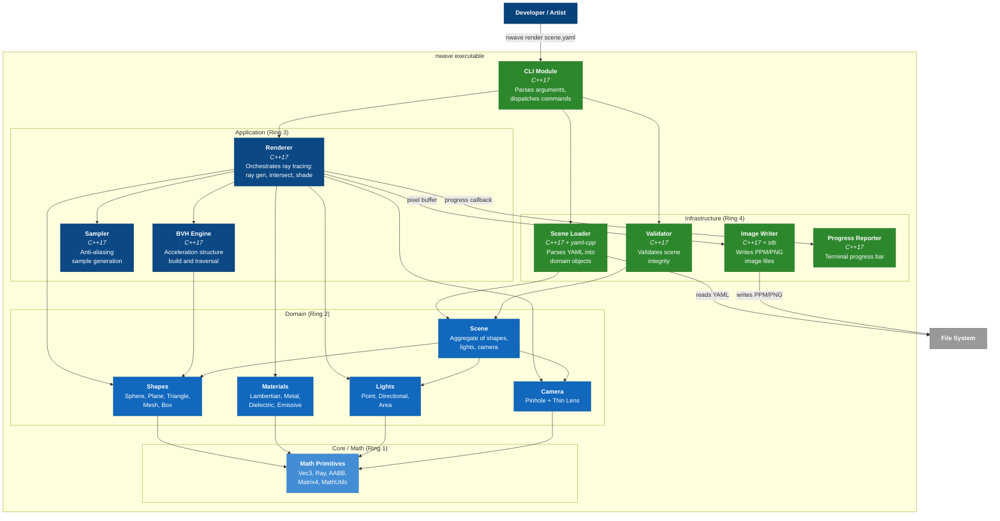

# C4 Container Diagram: nwave-raytracer

## Diagram



## Container Descriptions

### Infrastructure (Ring 4) -- Outermost

| Container | Technology | Responsibility |
|---|---|---|
| CLI Module | C++17 | Parses `argc/argv`, dispatches to validate or render sub-commands, merges CLI overrides |
| Scene Loader | C++17 + yaml-cpp | Reads YAML files, constructs domain objects (Scene, Shapes, Materials, Lights, Camera) |
| Validator | C++17 | Checks scene integrity: material references, parameter ranges, structural completeness |
| Image Writer | C++17 + stb_image_write | Writes pixel buffer to PPM (P3/P6) or PNG files |
| Progress Reporter | C++17 | Renders terminal progress bar with row count, elapsed time, ETA |

### Application (Ring 3)

| Container | Technology | Responsibility |
|---|---|---|
| Renderer | C++17 | Main rendering loop: pixel iteration, sample accumulation, trace_ray recursion, gamma correction |
| BVH Engine | C++17 | Builds bounding volume hierarchy from shape list; implements Shape interface for transparent traversal |
| Sampler | C++17 | Generates sub-pixel sample offsets (RandomSampler, StratifiedSampler) |

### Domain (Ring 2)

| Container | Technology | Responsibility |
|---|---|---|
| Shapes | C++17 | Abstract Shape with concrete Sphere, Plane, Triangle, TriangleMesh, Box |
| Materials | C++17 | Abstract Material with concrete Lambertian, Metal, Dielectric, Emissive |
| Lights | C++17 | Abstract Light with concrete PointLight, DirectionalLight, AreaLight |
| Camera | C++17 | Pinhole and thin-lens ray generation |
| Scene | C++17 | Aggregate container for shapes, lights, camera, settings |

### Core / Math (Ring 1) -- Innermost

| Container | Technology | Responsibility |
|---|---|---|
| Math Primitives | C++17 | Vec3, Point3, Color3, Ray, AABB, Matrix4x4, math constants and utilities |

## Dependency Flow

```
Infrastructure --> Application --> Domain --> Core
     |                                          ^
     +------------------------------------------+
                  (also depends on Core directly)
```

Each ring depends only on inner rings. No outward dependencies.
