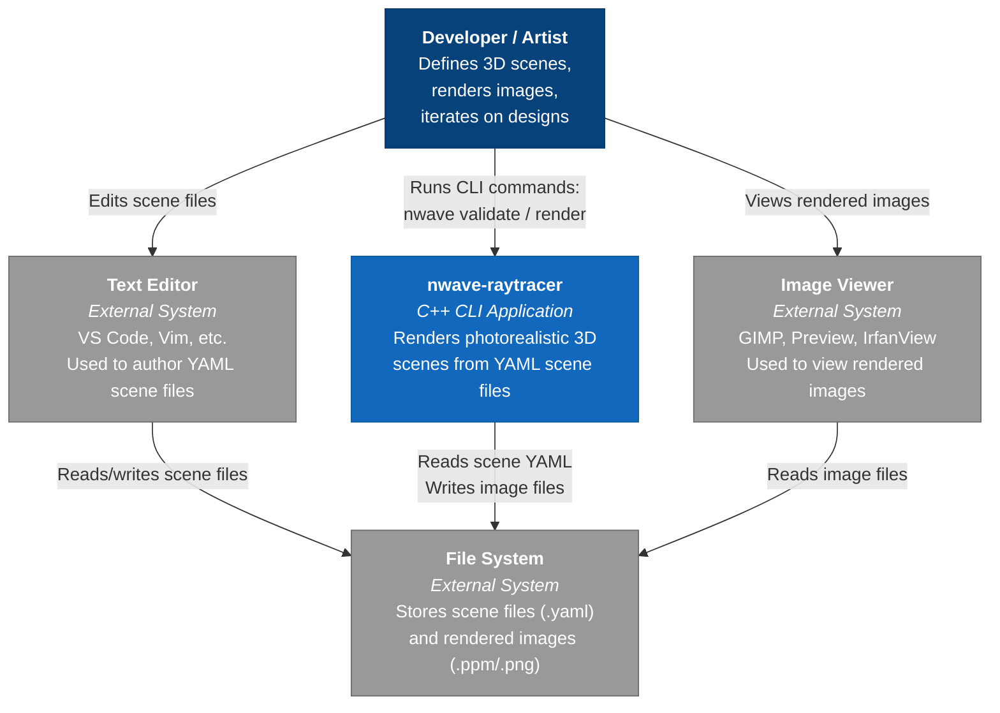

# C4 Context Diagram: nwave-raytracer

## Diagram

## Description

The system context shows nwave-raytracer as a single CLI application that:

1. **Receives** YAML scene files authored by the user in a text editor
2. **Produces** rendered image files (PPM or PNG) on the file system
3. **Is viewed** by the user through standard image viewing tools

There are no network dependencies, databases, or external services. The system is entirely self-contained and operates on local files.

## Actors

| Actor | Description |
|---|---|
| Developer / Artist | The primary user -- defines scenes, runs renders, iterates on designs. May be a CG student (Elena), hobbyist artist (David), CS instructor (Prof. Tanaka), or technical artist (Sofia). |

## External Systems

| System | Interaction |
|---|---|
| Text Editor | User creates and edits YAML scene files. No integration with nwave beyond shared file system. |
| Image Viewer | User opens rendered images. No integration with nwave beyond shared file system. |
| File System | The shared boundary: nwave reads scene files and writes image files. |
