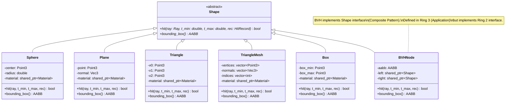
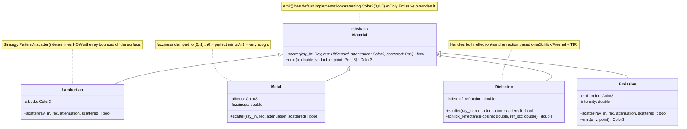
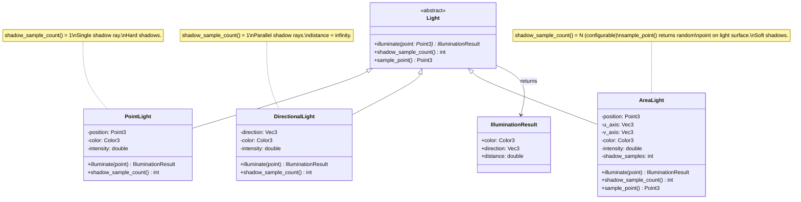
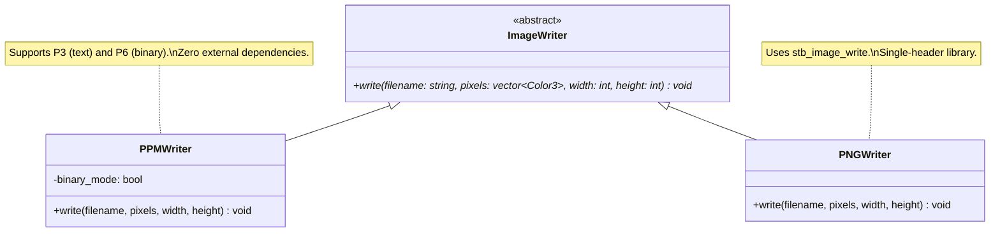
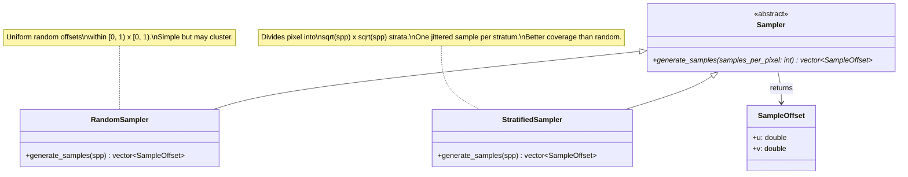
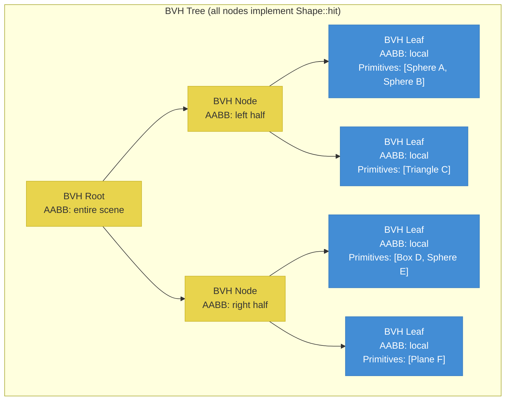

# Class Hierarchy Diagrams

## 1. Shape Hierarchy

### Shape Design Notes

- All shapes implement the same two-method interface: `hit` and `bounding_box`
- BVHNode implements Shape (Composite Pattern), so the renderer treats a BVH-accelerated scene identically to a flat shape list
- Plane has an infinite extent, so its bounding_box returns a very large AABB or requires special handling in BVH construction
- Sphere supports negative radius for normal inversion (hollow glass effect)
- TriangleMesh contains multiple triangles internally; each is tested via Moller-Trumbore

---

## 2. Material Hierarchy

### Material Design Notes

- Material uses the **Strategy Pattern**: each material defines a different scattering strategy
- `scatter` returns `false` when the ray is absorbed (Emissive always returns false; Metal may return false if perturbed ray goes below surface)
- `emit` has a default no-op implementation; only Emissive overrides it
- Dielectric's `scatter` always returns `true` (either reflects or refracts) with attenuation Color3(1,1,1) (no absorption in the basic model)
- Metal's fuzziness parameter is clamped to [0, 1] at construction time

---

## 3. Light Hierarchy

### Light Design Notes

- `shadow_sample_count` defaults to 1 (point and directional lights)
- Area lights override to return a configurable sample count (default 16)
- `sample_point` is meaningful only for area lights; it returns a random point on the light surface for each shadow sample
- The renderer's shading loop iterates shadow samples for each light, averaging the occluded/unoccluded results for soft shadow computation
- DirectionalLight sets distance to infinity for shadow rays, ensuring distant occluders are detected

---

## 4. Infrastructure: Writer and Loader

---

## 5. Application: Sampler

---

## 6. Composite Pattern: BVH as Shape

The Renderer calls `bvh_root.hit(ray, ...)` which recursively:
1. Tests the ray against the node's AABB
2. If miss, returns immediately (skips entire subtree)
3. If hit, recursively tests left and right children
4. Leaf nodes test their primitives directly

This is transparent to the Renderer because BVHNode implements the Shape interface.
