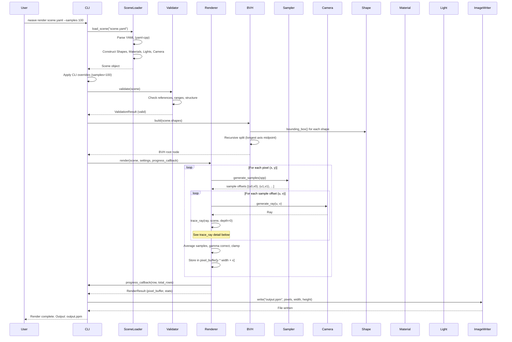
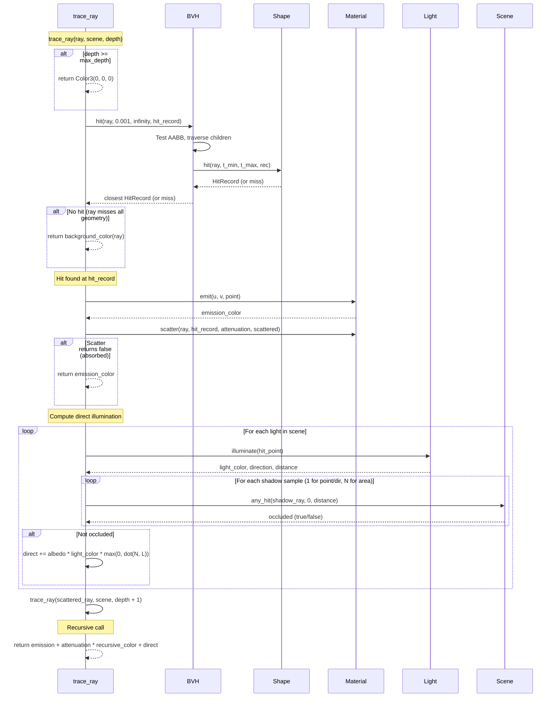

# Rendering Pipeline Sequence Diagram

## Main Render Flow

## trace_ray Detail

## Key Timing Characteristics

| Phase | Frequency | Performance Notes |
|---|---|---|
| Scene loading | Once per render | Negligible (small YAML files) |
| BVH construction | Once per render | O(N log N) where N = number of primitives |
| Pixel iteration | width * height times | Outer loop; parallelizable per row |
| Sample iteration | SPP times per pixel | Inner loop; sequential within pixel |
| trace_ray | SPP * width * height times (minimum) | Recursion multiplies this by avg depth |
| Shape::hit | O(log N) per ray (with BVH) | Hottest path; dominates render time |
| Material::scatter | Once per ray bounce | Relatively cheap; random number generation |
| Shadow rays | lights * shadow_samples per hit | "Any hit" early exit for efficiency |
