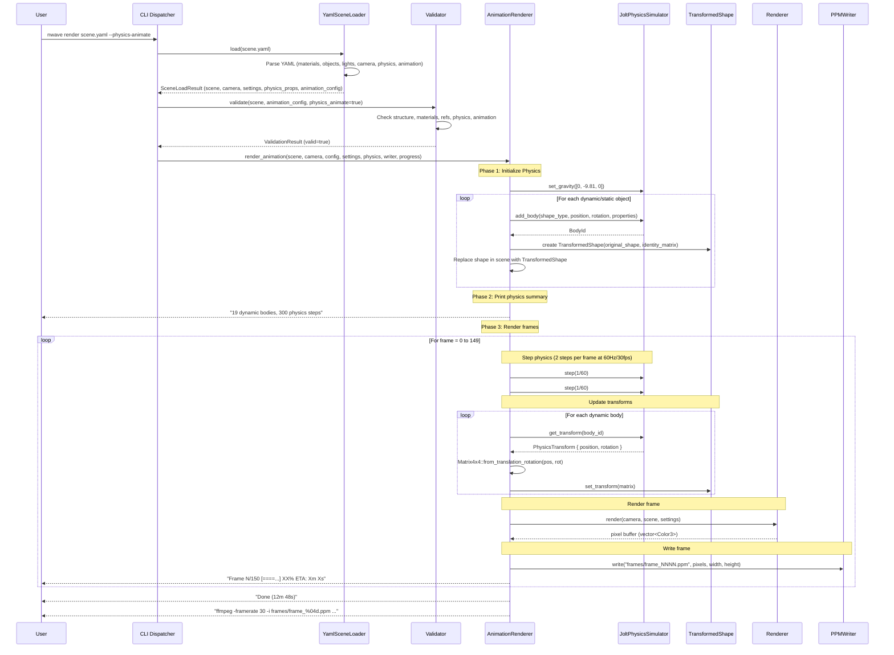

# Animation Rendering Pipeline -- Sequence Diagram

```mermaid
sequenceDiagram
    participant User
    participant CLI as CLI Dispatcher
    participant Loader as YamlSceneLoader
    participant Val as Validator
    participant AnimR as AnimationRenderer
    participant Phys as JoltPhysicsSimulator
    participant TShape as TransformedShape
    participant Rend as Renderer
    participant Writer as PPMWriter

    User->>CLI: nwave render scene.yaml --physics-animate
    CLI->>Loader: load(scene.yaml)
    Loader->>Loader: Parse YAML (materials, objects, lights, camera, physics, animation)
    Loader-->>CLI: SceneLoadResult (scene, camera, settings, physics_props, animation_config)

    CLI->>Val: validate(scene, animation_config, physics_animate=true)
    Val->>Val: Check structure, materials, refs, physics, animation
    Val-->>CLI: ValidationResult (valid=true)

    CLI->>AnimR: render_animation(scene, camera, config, settings, physics, writer, progress)

    Note over AnimR: Phase 1: Initialize Physics
    AnimR->>Phys: set_gravity([0, -9.81, 0])
    loop For each dynamic/static object
        AnimR->>Phys: add_body(shape_type, position, rotation, properties)
        Phys-->>AnimR: BodyId
        AnimR->>TShape: create TransformedShape(original_shape, identity_matrix)
        AnimR->>AnimR: Replace shape in scene with TransformedShape
    end

    Note over AnimR: Phase 2: Print physics summary
    AnimR-->>User: "19 dynamic bodies, 300 physics steps"

    Note over AnimR: Phase 3: Render frames
    loop For frame = 0 to 149
        Note over AnimR,Phys: Step physics (2 steps per frame at 60Hz/30fps)
        AnimR->>Phys: step(1/60)
        AnimR->>Phys: step(1/60)

        Note over AnimR,TShape: Update transforms
        loop For each dynamic body
            AnimR->>Phys: get_transform(body_id)
            Phys-->>AnimR: PhysicsTransform { position, rotation }
            AnimR->>AnimR: Matrix4x4::from_translation_rotation(pos, rot)
            AnimR->>TShape: set_transform(matrix)
        end

        Note over AnimR,Rend: Render frame
        AnimR->>Rend: render(camera, scene, settings)
        Rend-->>AnimR: pixel buffer (vector<Color3>)

        Note over AnimR,Writer: Write frame
        AnimR->>Writer: write("frames/frame_NNNN.ppm", pixels, width, height)

        AnimR-->>User: "Frame N/150 [====...] XX% ETA: Xm Xs"
    end

    AnimR-->>User: "Done (12m 48s)"
    AnimR-->>User: "ffmpeg -framerate 30 -i frames/frame_%04d.ppm ..."
```
