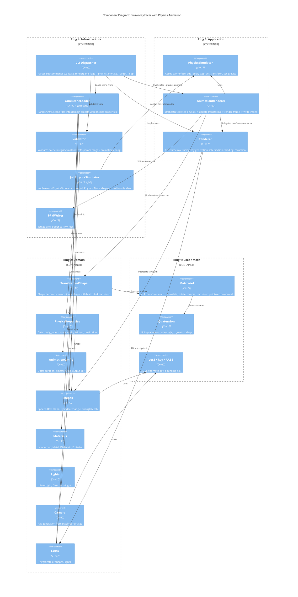

# C4 Component Diagram: Scene Physics Animation

```mermaid
C4Component
    title Component Diagram: nwave-raytracer with Physics Animation

    Container_Boundary(ring4, "Ring 4: Infrastructure") {
        Component(cli, "CLI Dispatcher", "C++17", "Parses subcommands (validate, render) and flags (--physics-animate, --width, --spp)")
        Component(loader, "YamlSceneLoader", "C++17 + yaml-cpp", "Parses YAML scene files into domain objects with physics properties")
        Component(validator, "Validator", "C++17", "Validates scene integrity: material refs, param ranges, animation config")
        Component(jolt, "JoltPhysicsSimulator", "C++17 + Jolt", "Implements PhysicsSimulator using Jolt Physics. Maps shapes to collision bodies.")
        Component(ppm, "PPMWriter", "C++17", "Writes pixel buffer to PPM files")
    }

    Container_Boundary(ring3, "Ring 3: Application") {
        Component(phys_if, "PhysicsSimulator", "C++17", "Abstract interface: add_body, step, get_transform, set_gravity")
        Component(anim, "AnimationRenderer", "C++17", "Orchestrates: step physics -> update transforms -> render frame -> write image")
        Component(renderer, "Renderer", "C++17", "Per-frame ray tracing: ray generation, intersection, shading, recursion")
    }

    Container_Boundary(ring2, "Ring 2: Domain") {
        Component(tshape, "TransformedShape", "C++17", "Shape decorator: wraps inner shape with Matrix4x4 transform")
        Component(physprops, "PhysicsProperties", "C++17", "Data: body_type, mass, velocity, friction, restitution")
        Component(animcfg, "AnimationConfig", "C++17", "Data: duration, timestep, fps, output_dir")
        Component(shapes, "Shapes", "C++17", "Sphere, Box, Plane, Cylinder, Triangle, TriangleMesh")
        Component(mats, "Materials", "C++17", "Lambertian, Metal, Dielectric, Emissive")
        Component(lights, "Lights", "C++17", "PointLight, DirectionalLight")
        Component(camera, "Camera", "C++17", "Ray generation from pixel coordinates")
        Component(scene, "Scene", "C++17", "Aggregate of shapes, lights")
    }

    Container_Boundary(ring1, "Ring 1: Core / Math") {
        Component(mat4, "Matrix4x4", "C++17", "4x4 transform matrix: translate, rotate, inverse, transform point/vector/normal")
        Component(quat, "Quaternion", "C++17", "Unit quaternion: axis-angle, to_matrix, slerp")
        Component(vec3, "Vec3 / Ray / AABB", "C++17", "3D vector math, ray, bounding box")
    }

    Rel(cli, loader, "Loads scene from")
    Rel(cli, validator, "Validates with")
    Rel(cli, anim, "Invokes for --physics-animate")
    Rel(cli, renderer, "Invokes for static render")
    Rel(loader, scene, "Constructs")
    Rel(loader, shapes, "Constructs")
    Rel(loader, mats, "Constructs")
    Rel(loader, physprops, "Parses into")
    Rel(loader, animcfg, "Parses into")
    Rel(validator, scene, "Inspects")
    Rel(jolt, phys_if, "Implements")
    Rel(anim, phys_if, "Uses")
    Rel(anim, renderer, "Delegates per-frame render to")
    Rel(anim, tshape, "Updates transforms on")
    Rel(anim, ppm, "Writes frames via")
    Rel(renderer, scene, "Hit tests against")
    Rel(renderer, shapes, "Intersects rays with")
    Rel(tshape, shapes, "Wraps")
    Rel(tshape, mat4, "Uses for ray transform")
    Rel(mat4, quat, "Constructs from")
    Rel(shapes, vec3, "Uses")
    Rel(camera, vec3, "Uses")
```
