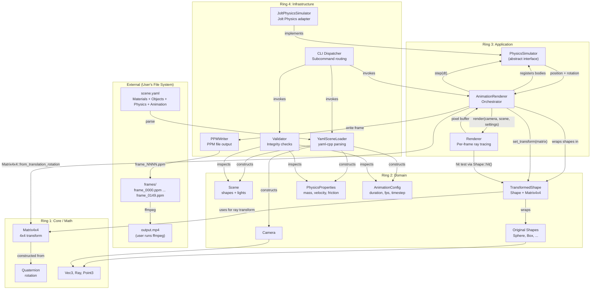

# Physics Integration Data Flow

## Overview

This diagram shows how data flows from the YAML scene file through physics simulation to rendered frames, crossing architectural ring boundaries at each step.

## Ring Boundary Crossings

| # | Crossing | From | To | Data | Direction |
|---|---|---|---|---|---|
| 1 | YAML to Domain | Ring 4 (Loader) | Ring 2 (Scene, PhysicsProperties) | Parsed scene objects | Inward (R4 -> R2) |
| 2 | Domain to Physics | Ring 3 (AnimationRenderer) | Ring 3/4 (PhysicsSimulator/Jolt) | PhysicsBodyDesc (shape type + properties) | Outward via interface (R3 -> R4 impl) |
| 3 | Physics to Math | Ring 4 (Jolt) | Ring 1 (Matrix4x4, Quaternion) | Position + rotation -> transform matrix | Inward (R4 -> R1) |
| 4 | Math to Domain | Ring 1 (Matrix4x4) | Ring 2 (TransformedShape) | Transform matrix applied to shape | Inward (R1 -> R2) |
| 5 | Domain to Renderer | Ring 2 (TransformedShape) | Ring 3 (Renderer) | Shape::hit() interface | Inward (R2 -> R3) |
| 6 | Renderer to Writer | Ring 3 (Renderer) | Ring 4 (PPMWriter) | Pixel buffer | Outward via callback (R3 -> R4) |

All crossings respect the dependency rule: code dependencies always point inward. Data flows both ways, but only through interfaces defined in inner rings (PhysicsSimulator in R3) or callbacks (write_frame, progress).

## Transform Pipeline Detail

```mermaid
flowchart LR
    subgraph Jolt["Jolt Physics (Ring 4)"]
        JP["JPH::BodyInterface"]
    end

    subgraph Adapter["JoltPhysicsSimulator (Ring 4)"]
        GT["get_transform()"]
    end

    subgraph Math["Core Math (Ring 1)"]
        FTR["Matrix4x4::from_translation_rotation()"]
    end

    subgraph Domain["TransformedShape (Ring 2)"]
        ST["set_transform(matrix)"]
        HIT["hit(ray, t_min, t_max, rec)"]
    end

    subgraph Render["Renderer (Ring 3)"]
        TR["trace_ray()"]
    end

    JP -->|"JPH::RVec3 position<br/>JPH::Quat rotation"| GT
    GT -->|"PhysicsTransform<br/>{Point3, Quaternion}"| FTR
    FTR -->|"Matrix4x4"| ST
    ST -->|"stores inverse,<br/>inverse-transpose"| HIT

    TR -->|"Ray"| HIT
    HIT -->|"1. inverse_transform * ray<br/>2. inner_shape.hit(local_ray)<br/>3. transform * hit_point<br/>4. inv_transpose * normal"| TR
```

