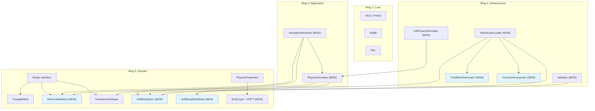
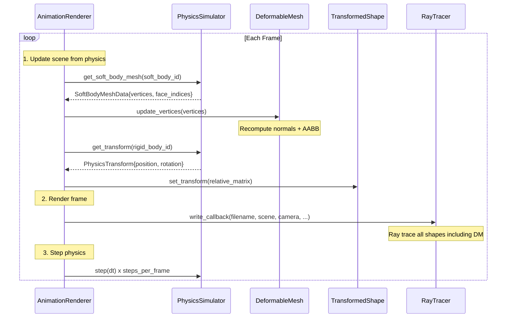
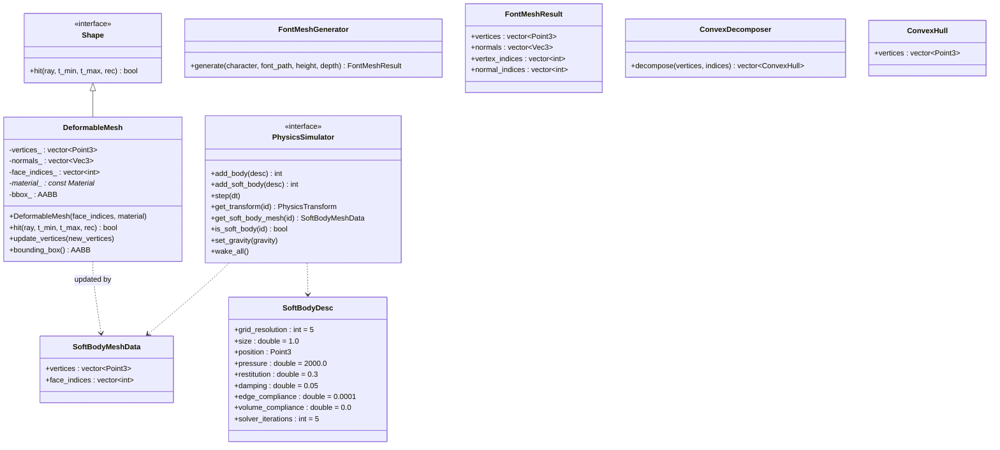

# Architecture Design: Soft Body Jelly Physics

**Feature**: Deformable jelly cube with physics-driven animation
**Date**: 2026-02-19
**Architecture Style**: Clean Architecture (4-ring: Core > Domain > Application > Infrastructure)
**System Design**: Monolithic CLI, sequential pipeline

---

## 1. Existing System Analysis

### What Exists

| Component | File | Ring | Relevance |
|---|---|---|---|
| `Shape` interface | `src/domain/shapes/shape.h` | Domain | Base class for all renderable shapes. `hit()` pure virtual. DeformableMesh must implement this. |
| `TriangleMesh` | `src/domain/shapes/triangle_mesh.h/.cpp` | Domain | Moller-Trumbore ray-triangle intersection with smooth normals. Reference for DeformableMesh. Uses linear face scan (no BVH). |
| `TransformedShape` | `src/domain/shapes/transformed_shape.h` | Domain | Applies rigid transform to inner shape. Used by AnimationRenderer for rigid bodies. Not suitable for per-vertex deformation. |
| `PhysicsSimulator` | `src/application/physics_simulator.h` | Application | Abstract interface: `add_body()`, `step()`, `get_transform()`, `set_gravity()`, `wake_all()`. Must be extended for soft bodies. |
| `PhysicsProperties` / `BodyType` | `src/domain/physics_properties.h` | Domain | Enum has STATIC, DYNAMIC, KINEMATIC. Struct has mass, friction, restitution, initial_velocity, start_asleep. |
| `JoltPhysicsSimulator` | `src/infrastructure/jolt_physics_simulator.h/.cpp` | Infrastructure | Jolt v5.2.0 adapter. Pimpl pattern. Creates rigid bodies, steps physics, extracts transforms. Two collision layers: STATIC(0), DYNAMIC(1). |
| `AnimationRenderer` | `src/application/animation_renderer.h/.cpp` | Application | Per-frame loop: update rigid transforms via `TransformedShape::set_transform()`, render, step physics. Needs soft body branch. |
| `YamlSceneLoader` | `src/infrastructure/yaml_scene_loader.h/.cpp` | Infrastructure | Parses materials, objects (sphere/plane/box/cylinder/triangle/triangle_mesh), lights, camera, animation config. Returns `SceneLoadResult`. |
| `SceneLoadResult` | `src/infrastructure/yaml_scene_loader.h` | Infrastructure | Holds Scene, Camera, materials_storage, shape_physics vector, optional AnimationConfig. Needs extension for soft body descriptions. |
| `Validator` | `src/infrastructure/validator.h/.cpp` | Infrastructure | Scene validation. Must be extended for soft body parameter ranges. |
| `SceneFlattener` (GPU) | `src/infrastructure/gpu/scene_flattener.cpp` | Infrastructure | Flattens shapes for Metal GPU. Already skips TriangleMesh with warning. DeformableMesh will also be skipped (CPU-only for v1). |

### What Can Be Reused

- **TriangleMesh intersection algorithm**: DeformableMesh reuses the same Moller-Trumbore + barycentric smooth normal interpolation pattern.
- **AnimationRenderer loop structure**: Extend the existing per-frame loop with a soft body branch rather than replacing it.
- **Collision layer setup**: The existing STATIC/DYNAMIC layer pair allows soft body (on DYNAMIC layer) to collide with both static floors and dynamic rigid bodies.
- **YAML parsing patterns**: Extend `create_shape()` and `parse_physics()` with new type branches following existing conventions.
- **Validation patterns**: Extend `Validator` with soft body parameter checks following existing error/warning pattern.

### What Must Be New

| New Component | Justification |
|---|---|
| `SoftBodyDesc` | No existing type captures soft body creation parameters (grid_resolution, pressure, compliance, etc.). PhysicsProperties is rigid-body-specific. |
| `SoftBodyMeshData` | No existing type represents per-frame deformed mesh data (mutable vertices + constant face indices). |
| `DeformableMesh` | TriangleMesh is immutable (vertices set at construction). No existing shape supports per-frame vertex updates with normal recomputation. |
| `PhysicsSimulator` soft body methods | Interface has no concept of soft bodies. Three new pure virtual methods needed. |
| Font mesh generator | No font-to-mesh capability exists. The current 'e' in nwave_bowling.yaml is 12 manually positioned boxes. |
| Convex decomposition adapter | No convex decomposition exists. Needed because Jolt MeshShape is static-only; dynamic letter needs compound convex hulls. |

---

## 2. Component Architecture

### New Components by Ring

```
Ring 1 (Core)
  -- No new types needed. Existing Point3, Vec3, AABB, Ray suffice.

Ring 2 (Domain)
  NEW: SoftBodyDesc           (soft body creation parameters)
  NEW: SoftBodyMeshData       (per-frame deformed mesh data)
  NEW: DeformableMesh         (Shape subclass with mutable vertices)
  MOD: BodyType enum          (add SOFT value)

Ring 3 (Application)
  MOD: PhysicsSimulator       (add_soft_body, is_soft_body, get_soft_body_mesh)
  MOD: AnimationRenderer      (soft body per-frame update branch)

Ring 4 (Infrastructure)
  MOD: JoltPhysicsSimulator   (implement soft body methods using Jolt XPBD)
  MOD: YamlSceneLoader        (parse soft_body_cube and letter object types)
  MOD: Validator              (soft body parameter range validation)
  MOD: SceneLoadResult        (carry SoftBodyDesc data)
  NEW: FontMeshGenerator      (ttf2mesh adapter: glyph to extruded 3D mesh)
  NEW: ConvexDecomposer       (V-HACD adapter: concave mesh to convex hulls)
```

### Component Diagram



---

## 3. Integration Points

### IP-1: YAML Parse to Scene Construction

**Flow**: YAML string --> YamlSceneLoader --> SceneLoadResult (Scene + shape_physics + soft_body_descs)

- `type: soft_body_cube` creates a DeformableMesh (initial cube vertices) + SoftBodyDesc + PhysicsProperties with BodyType::SOFT
- `type: letter` invokes FontMeshGenerator to create TriangleMesh + ConvexDecomposer for physics hulls
- SceneLoadResult extended with `std::vector<std::optional<SoftBodyDesc>> soft_body_descs` parallel to shape_physics

### IP-2: Scene Construction to Physics Registration

**Flow**: AnimationRenderer reads SceneLoadResult, registers bodies with PhysicsSimulator

- For BodyType::SOFT shapes: call `physics->add_soft_body(soft_body_desc)` instead of `physics->add_body()`
- For letter with convex hulls: extend PhysicsBodyDesc with a COMPOUND_MESH shape type that carries the hull data, or add a new `add_body_with_hulls()` method
- Collision layers: soft bodies use DYNAMIC layer (collide with everything)

### IP-3: Per-Frame Physics to Mesh Update

**Flow**: PhysicsSimulator --> SoftBodyMeshData --> DeformableMesh::update_vertices()

- AnimationRenderer calls `physics->get_soft_body_mesh(body_id)` per soft body per frame
- Passes vertex positions to `DeformableMesh::update_vertices()`
- DeformableMesh recomputes normals and AABB internally
- Sequential pipeline: physics step completes before any mesh reads (no concurrency)

### IP-4: DeformableMesh to Ray Tracer

**Flow**: Ray --> DeformableMesh::hit() --> HitRecord

- Same ray-triangle intersection as TriangleMesh (Moller-Trumbore)
- AABB early rejection on recomputed bounding box
- Smooth normals via barycentric interpolation of per-vertex normals
- Material pointer returned in HitRecord

---

## 4. Data Flow: Per-Frame Sequential Pipeline



**Key ordering**: Frame 0 renders the undisturbed scene (physics steps AFTER render), matching existing AnimationRenderer behavior.

---

## 5. Class Diagram: New Types



---

## 6. Key Design Decisions

### KD-1: DeformableMesh as Separate Shape (Not TriangleMesh Extension)

**Decision**: Create a new `DeformableMesh` shape class rather than making `TriangleMesh` mutable.

**Rationale**:
- TriangleMesh is designed as immutable (vertices set once at construction, separate vertex/normal index arrays)
- DeformableMesh has different invariants: vertices change per frame, normals are always smooth and auto-computed, face indices use a flat 3-per-triangle layout matching Jolt's output
- Adding mutability to TriangleMesh would violate its current contract and risk breaking existing behavior
- Clean separation aligns with Single Responsibility Principle

**Rejected alternative**: Making TriangleMesh mutable with an `update_vertices()` method. Rejected because it changes the semantics of an established type and complicates the normal index system (TriangleMesh supports separate normal indices; DeformableMesh always has 1:1 vertex-to-normal mapping).

### KD-2: Frame-Locked Sequential Pipeline (No Double Buffering)

**Decision**: Physics step completes before mesh extraction; mesh extraction completes before rendering. No concurrent access to DeformableMesh data.

**Rationale**:
- The existing AnimationRenderer already uses a sequential loop (step -> update -> render)
- This is an offline renderer, not real-time; frame throughput is not latency-sensitive
- Sequential ordering eliminates all thread safety concerns without locks or double buffers
- Matches the existing pattern perfectly -- minimal code change

**Rejected alternative**: Double-buffered vertex data with swap. Rejected because the sequential pipeline already prevents concurrent access; adding double buffering would increase memory usage and code complexity for zero benefit.

### KD-3: Normals Computed in DeformableMesh, Not PhysicsSimulator

**Decision**: `get_soft_body_mesh()` returns only vertex positions and face indices. DeformableMesh computes smooth normals internally during `update_vertices()`.

**Rationale**:
- Normal computation is a rendering concern, not a physics concern
- Jolt's `SoftBodyShape::GetSurfaceNormal` returns flat (per-face) normals; smooth normals require area-weighted vertex averaging, which is a rendering-specific algorithm
- Keeping normals in DeformableMesh follows Clean Architecture: domain shape owns its rendering data
- SoftBodyMeshData stays minimal (only data that crosses the physics boundary)

### KD-4: Convex Decomposition for Dynamic Letter Physics

**Decision**: Use V-HACD to decompose the letter mesh into convex hulls, then create a Jolt StaticCompoundShape for the dynamic rigid body.

**Rationale**:
- Jolt's MeshShape is static-only; the letter must be dynamic (knocked over by jelly)
- Convex decomposition is the standard approach for concave dynamic bodies in game physics
- V-HACD is the most widely used open-source library for this purpose
- Decomposition runs once at scene load time (not per-frame)

**Rejected alternative**: Manual compound shape from boxes/cylinders approximating the letter. Rejected because it would produce poor collision fidelity and require per-character manual work.

### KD-5: PhysicsShapeType Extension for Compound Mesh

**Decision**: Add `COMPOUND_MESH` to `PhysicsShapeType` and extend `PhysicsBodyDesc` with an optional vector of convex hulls for the letter's physics shape.

**Rationale**:
- The existing `add_body()` uses `PhysicsBodyDesc` with a `PhysicsShapeType` to select collision shape
- Adding COMPOUND_MESH follows the same pattern rather than introducing a separate method
- The convex hull data flows through the existing body registration path
- JoltPhysicsSimulator creates ConvexHullShapes and combines them into StaticCompoundShape

**Rejected alternative**: Separate `add_body_with_hulls()` method. Rejected because it fragments the interface unnecessarily when the existing pattern can accommodate it.

### KD-6: CPU-Only Rendering for Soft Body Scenes (v1)

**Decision**: DeformableMesh is CPU-rendered only. The GPU SceneFlattener skips it (same as TriangleMesh today).

**Rationale**:
- The GPU Metal pipeline uploads vertex buffers once; per-frame updates require significant shader and buffer management changes
- TriangleMesh is already CPU-only in the GPU path
- This is an offline renderer; CPU rendering is acceptable
- GPU support can be added in a future iteration

---

## 7. Error Handling Strategy

| Error Condition | Detection Point | Response |
|---|---|---|
| NaN vertex positions after physics step | DeformableMesh::update_vertices() | Halt with error message identifying the soft body and frame number |
| Font file not found | YamlSceneLoader (scene load time) | Throw with descriptive error: "Font file not found: {path}" |
| Unsupported glyph | FontMeshGenerator (scene load time) | Throw with error: "Glyph '{char}' not found in font: {font}" |
| Invalid soft body parameters | Validator (pre-simulation) | Error/warning per parameter with guidance (see validation rules in requirements) |
| Soft body divergence (vertices spread to extreme positions) | DeformableMesh::update_vertices() via AABB size check | Halt with error if AABB exceeds 100x original size |

---

## 8. Backward Compatibility

- Existing YAML scenes (no soft body objects) parse and render identically
- PhysicsSimulator new methods are pure virtual; JoltPhysicsSimulator implements them. No other implementations exist to break.
- BodyType::SOFT is a new enum value; existing switch statements that handle STATIC/DYNAMIC/KINEMATIC continue to work. The `map_body_type_to_motion()` function in JoltPhysicsSimulator needs a SOFT case.
- AnimationRenderer soft body branch activates only when shape_physics contains BodyType::SOFT entries; for all-rigid scenes, the existing code path executes unchanged.
- SceneLoadResult extended with optional soft_body_descs field with default empty state.
- GPU SceneFlattener already skips unknown shapes; DeformableMesh will be skipped with a warning, same as TriangleMesh.

---

## 9. Deployment Architecture

No changes. Single binary CLI application. New dependencies (ttf2mesh, V-HACD) are compiled in via CMake FetchContent. No runtime services, no configuration files beyond YAML scenes. A default font file is embedded or bundled alongside the binary.

---

## REVIEW METADATA

**Review Date**: 2026-02-19
**Review Status**: CONDITIONALLY_APPROVED
**Reviewer Role**: Solution Architecture Reviewer (Atlas)
**Review Model**: Haiku 4.5

### Summary

Design quality is strong overall with clear ring architecture, well-justified technology choices, and complete user story traceability. Critical and major issues relate to implementation details (PhysicsBodyDesc integration, AnimationRenderer tracking, normal recomputation pseudocode) rather than architectural flaws. All issues are resolvable and do not block approval conditional on clarification.

### Issue Counts

| Severity | Count | Status |
|---|---|---|
| CRITICAL | 1 | Requires resolution |
| MAJOR | 4 | Requires resolution (3 implementation details, 1 design quality) |
| MINOR | 2 | Should resolve |
| SUGGESTION | 1 | Informational |

### Critical Issues

**C-01: Incomplete PhysicsBodyDesc Extension for Compound Mesh**
- Location: data-models.md (lines 105-122), component-boundaries.md (lines 334-344)
- Issue: Design specifies convex_hulls field and COMPOUND_MESH shape type but lacks detail on PhysicsBodyDesc struct changes and JoltPhysicsSimulator::add_body() COMPOUND_MESH case implementation
- Action: Document exact PhysicsBodyDesc field additions and provide pseudo-code showing Jolt ConvexHullShapeSettings and StaticCompoundShapeSettings usage

### Major Issues (Implementation Details)

**M-01: Animation Renderer Integration Missing Key Details**
- Location: architecture-design.md (IP-3), component-boundaries.md (line 88)
- Issue: Unclear how AnimationRenderer tracks soft body IDs, filters shapes, and manages DeformableMesh pointers for per-frame updates
- Action: Add concrete per-frame update loop diagram showing shape filtering by BodyType and soft body shape storage strategy

**M-02: Data Model Inconsistency in SoftBodyMeshData**
- Location: data-models.md (lines 31-44)
- Issue: Unclear whether face_indices are returned every frame (wasteful) or cached at creation time (efficient)
- Action: Clarify caching strategy and recommend face_indices be cached at add_soft_body() time, with get_soft_body_mesh() returning vertices only

**M-03: BodyType Enum Extension Does Not Cover All Switch Statements**
- Location: architecture-design.md (section 8), data-models.md (line 99)
- Issue: Design mentions SOFT case in map_body_type_to_motion() but lacks complete audit of all BodyType switch statements
- Action: Provide checklist of all switch statements requiring SOFT case handling: animation_renderer.cpp::is_movable_body(), yaml_scene_loader.cpp::parse_body_type(), etc.

### Major Issues (Design Quality)

**M-04: Normal Recomputation Algorithm Under-Specified**
- Location: data-models.md (lines 67-75), user-stories.md (US-06, line 509)
- Issue: Algorithm description correct but lacks pseudocode and edge case handling (vertex shared by 1 face, initialization, ordering)
- Action: Add detailed pseudocode under DeformableMesh::update_vertices() Contract section 3

### Minor Issues

**m-01: Font Mesh Generator Output Type Inconsistency**
- Location: data-models.md (lines 138-155), component-boundaries.md (lines 127-135)
- Issue: FontMeshResult has separate vertex_indices and normal_indices (TriangleMesh style) but DeformableMesh uses flat layout; scope unclear
- Action: Clarify FontMeshResult is for TriangleMesh rendering only; soft bodies always use DeformableMesh

**m-02: GPU SceneFlattener Handling Mentioned But Not Specified**
- Location: architecture-design.md (KD-6, lines 346-354)
- Issue: CPU-only rendering stated but unclear if SceneFlattener already skips unknown shapes or if new code needed
- Action: Verify implementation and document behavior explicitly

### Architectural Compliance

| Criterion | Status | Evidence |
|---|---|---|
| Clean Architecture Rings | PASS | Domain types have no Jolt deps; ring dependencies respected |
| User Story Traceability | PASS | All 13 stories (US-01 to US-13) addressed |
| Technology Justification | PASS | ADR-001 and ADR-002 documented with alternatives |
| Data Flow Correctness | PASS | Sequence diagrams clear; per-frame ordering correct |
| Implementability | PASS | User story estimates (18-22 days) feasible with clarifications |

### Recommendation

**CONDITIONALLY_APPROVED** - Design approved for implementation handoff pending resolution of critical and major issues. No architectural flaws detected. Issues are clarification and pseudocode additions that do not require redesign.

### Next Steps

1. Resolve C-01 by documenting PhysicsBodyDesc convex_hulls extension with pseudo-code
2. Resolve M-01 by adding per-frame update loop diagram
3. Resolve M-02 by choosing caching strategy and documenting SoftBodyMeshData contract
4. Resolve M-03 by providing BodyType switch statement audit checklist
5. Resolve M-04 by adding normal recomputation pseudocode
6. Address minor issues m-01 and m-02 before code review
7. Publish updated architecture document with clarifications
8. Gate user story implementation on this review approval

---

**Review Completion Time**: 45 minutes
**Artifacts Reviewed**: 4 design documents + 3 requirements documents + 6 context files
**Total Findings**: 8 (1 critical, 4 major, 2 minor, 1 suggestion)
