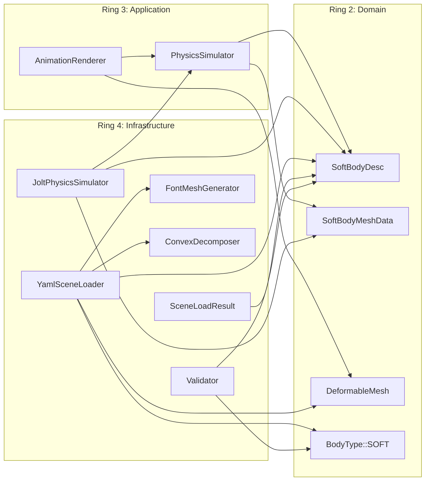

# Component Boundaries: Soft Body Jelly Physics

**Date**: 2026-02-19

---

## Ring Dependency Rule

```
Core <-- Domain <-- Application <-- Infrastructure
```

Each ring depends only on inner rings. No outward dependencies.

---

## Ring 1: Core

**No new types required.**

Existing types used by the new feature:

| Type | File | Used By |
|---|---|---|
| `Point3` / `Vec3` | `core/vec3.h` | SoftBodyDesc position, SoftBodyMeshData vertices, DeformableMesh vertices/normals |
| `AABB` | `core/aabb.h` | DeformableMesh bounding box recomputation |
| `Ray` | `core/ray.h` | DeformableMesh::hit() |

---

## Ring 2: Domain

### NEW: SoftBodyDesc

| Attribute | Value |
|---|---|
| **File** | `src/domain/soft_body_desc.h` |
| **Responsibility** | Value type describing soft body creation parameters. Pure data, no behavior. |
| **Dependencies** | `core/vec3.h` (Point3 for position) |
| **Consumed by** | PhysicsSimulator::add_soft_body() (Application), YamlSceneLoader (Infrastructure) |

### NEW: SoftBodyMeshData

| Attribute | Value |
|---|---|
| **File** | `src/domain/soft_body_mesh_data.h` |
| **Responsibility** | Value type holding per-frame deformed mesh: world-space vertex positions and constant face indices. |
| **Dependencies** | `core/vec3.h` (Point3 for vertices) |
| **Produced by** | PhysicsSimulator::get_soft_body_mesh() (Application) |
| **Consumed by** | AnimationRenderer (Application) which passes vertices to DeformableMesh |

### NEW: DeformableMesh

| Attribute | Value |
|---|---|
| **File** | `src/domain/shapes/deformable_mesh.h`, `src/domain/shapes/deformable_mesh.cpp` |
| **Responsibility** | Shape subclass for ray intersection against geometry with per-frame changing vertices. Owns vertex data, normal computation, and AABB recomputation. |
| **Dependencies** | `domain/shapes/shape.h`, `core/vec3.h`, `core/aabb.h`, `domain/materials/material.h` |
| **Interface** | `hit()` (from Shape), `update_vertices()`, `bounding_box()` |
| **Consumed by** | AnimationRenderer (updates vertices per frame), RayTracer (intersects rays) |

### MODIFIED: BodyType Enum

| Attribute | Value |
|---|---|
| **File** | `src/domain/physics_properties.h` (existing) |
| **Change** | Add `SOFT` value to existing enum: `{ STATIC, DYNAMIC, KINEMATIC, SOFT }` |
| **Impact** | All switch statements on BodyType must handle the new value. Existing code for STATIC/DYNAMIC/KINEMATIC unchanged. |

---

## Ring 3: Application

### MODIFIED: PhysicsSimulator

| Attribute | Value |
|---|---|
| **File** | `src/application/physics_simulator.h` (existing) |
| **New methods** | `add_soft_body(const SoftBodyDesc&) -> int`, `is_soft_body(int) -> bool`, `get_soft_body_mesh(int) -> SoftBodyMeshData` |
| **Dependencies** | Adds: `domain/soft_body_desc.h`, `domain/soft_body_mesh_data.h` |
| **Impact** | All implementations of PhysicsSimulator must implement new pure virtuals. Currently only JoltPhysicsSimulator. |

### MODIFIED: AnimationRenderer

| Attribute | Value |
|---|---|
| **File** | `src/application/animation_renderer.h`, `src/application/animation_renderer.cpp` (existing) |
| **Changes** | (1) Accept soft body descriptions in constructor. (2) Register soft bodies via add_soft_body() during setup. (3) Per-frame: extract deformed mesh and call DeformableMesh::update_vertices() for each soft body. (4) Track soft body shape indices separately from rigid body shape indices. |
| **Dependencies** | Adds: `domain/shapes/deformable_mesh.h`, `domain/soft_body_desc.h` |
| **Boundary rule** | AnimationRenderer orchestrates but does not know about Jolt. It calls PhysicsSimulator interface methods only. |

---

## Ring 4: Infrastructure

### MODIFIED: JoltPhysicsSimulator

| Attribute | Value |
|---|---|
| **File** | `src/infrastructure/jolt_physics_simulator.h`, `src/infrastructure/jolt_physics_simulator.cpp` (existing) |
| **Changes** | Implement `add_soft_body()`: generate NxNxN vertex grid, edge constraints, tetrahedral volume constraints, surface faces using Jolt's SoftBodyCreationSettings/SoftBodySharedSettings. Implement `is_soft_body()`: check if body ID is in soft body set. Implement `get_soft_body_mesh()`: lock body, read SoftBodyMotionProperties vertices, apply center-of-mass transform to world space, return SoftBodyMeshData. |
| **Internal state** | Add `std::set<int> soft_body_indices_` to Impl struct to track which body IDs are soft. |
| **Jolt headers** | Add: `SoftBodyCreationSettings.h`, `SoftBodySharedSettings.h`, `SoftBodyMotionProperties.h`, `SoftBodyVertex.h` |

### MODIFIED: YamlSceneLoader

| Attribute | Value |
|---|---|
| **File** | `src/infrastructure/yaml_scene_loader.h`, `src/infrastructure/yaml_scene_loader.cpp` (existing) |
| **Changes** | (1) Extend `parse_body_type()` to recognize "soft" -> BodyType::SOFT. (2) Add `type: soft_body_cube` branch in `create_shape()`: creates DeformableMesh with initial cube geometry, creates SoftBodyDesc from YAML physics properties. (3) Add `type: letter` branch: invokes FontMeshGenerator, creates TriangleMesh, optionally invokes ConvexDecomposer for physics. (4) Extend SceneLoadResult with soft_body_descs vector. |
| **Dependencies** | Adds: FontMeshGenerator, ConvexDecomposer, DeformableMesh, SoftBodyDesc |

### MODIFIED: SceneLoadResult

| Attribute | Value |
|---|---|
| **File** | `src/infrastructure/yaml_scene_loader.h` (existing) |
| **Change** | Add field: `std::vector<std::optional<SoftBodyDesc>> soft_body_descs` parallel to shape_physics. Non-soft-body shapes have std::nullopt. |

### MODIFIED: Validator

| Attribute | Value |
|---|---|
| **File** | `src/infrastructure/validator.h`, `src/infrastructure/validator.cpp` (existing) |
| **Changes** | Add validation rules for soft body parameters: grid_resolution [2,15], pressure >= 0, solver_iterations >= 1, compliance >= 0, body_type consistency. Add warnings for pressure > 10000, solver_iterations < 3. Add letter validation: character is single printable ASCII, font path exists or is "default". |

### NEW: FontMeshGenerator

| Attribute | Value |
|---|---|
| **File** | `src/infrastructure/font_mesh_generator.h`, `src/infrastructure/font_mesh_generator.cpp` |
| **Responsibility** | Adapter for ttf2mesh. Converts a character + font + height + depth into a closed 3D triangle mesh (vertices, normals, face indices). Handles glyph outline extraction, 2D triangulation, extrusion to 3D, and normal computation. |
| **Dependencies** | ttf2mesh library, `core/vec3.h` |
| **Consumed by** | YamlSceneLoader (at scene load time) |
| **Output** | FontMeshResult: vertices, normals, vertex_indices, normal_indices (compatible with TriangleMesh constructor) |

### NEW: ConvexDecomposer

| Attribute | Value |
|---|---|
| **File** | `src/infrastructure/convex_decomposer.h`, `src/infrastructure/convex_decomposer.cpp` |
| **Responsibility** | Adapter for V-HACD. Decomposes a concave triangle mesh into a set of convex hulls suitable for Jolt's ConvexHullShape / StaticCompoundShape. |
| **Dependencies** | V-HACD library, `core/vec3.h` |
| **Consumed by** | YamlSceneLoader (at scene load time, for letter physics bodies) |
| **Output** | `std::vector<ConvexHull>` where each hull is a `std::vector<Point3>` of vertices |

---

## Component Dependency Diagram



---

## Boundary Contracts Summary

| Boundary | Producer | Consumer | Data Crossing |
|---|---|---|---|
| YAML -> Domain types | YamlSceneLoader | AnimationRenderer (via SceneLoadResult) | SoftBodyDesc, DeformableMesh, PhysicsProperties with BodyType::SOFT |
| Application -> Physics | AnimationRenderer | PhysicsSimulator | SoftBodyDesc (in), SoftBodyMeshData (out), body IDs |
| Physics -> Rendering | PhysicsSimulator (via AnimationRenderer) | DeformableMesh | vertex positions (vector of Point3) |
| Domain -> Ray Tracer | DeformableMesh | Scene::hit() loop | HitRecord with point, normal, t, material |
| Infrastructure -> Physics | FontMeshGenerator + ConvexDecomposer | JoltPhysicsSimulator (via PhysicsBodyDesc) | Convex hull vertices for compound collision shape |
