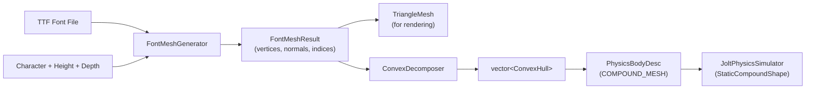
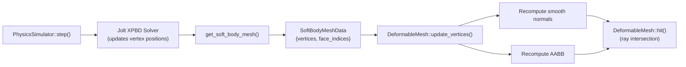

# Data Models: Soft Body Jelly Physics

**Date**: 2026-02-19

---

## 1. SoftBodyDesc

**Ring**: Domain (`src/domain/soft_body_desc.h`)
**Purpose**: Describes soft body creation parameters. Passed from YAML parsing to PhysicsSimulator.

| Field | Type | Default | Constraints | Description |
|---|---|---|---|---|
| `grid_resolution` | int | 5 | [2, 15] | Vertex grid dimension (NxNxN). 5 = 125 vertices. |
| `size` | double | 1.0 | > 0 | Cube edge length in world units. Grid spacing = size / grid_resolution. |
| `position` | Point3 | (0,0,0) | -- | Initial center position in world space. |
| `pressure` | double | 2000.0 | >= 0; warn > 10000 | Internal inflation pressure. Higher = more bounce-back force. |
| `restitution` | double | 0.3 | [0, 1] | Collision bounce coefficient. |
| `damping` | double | 0.05 | >= 0 | Linear velocity damping. Lower = more wobble. |
| `edge_compliance` | double | 0.0001 | >= 0 | Inverse stiffness of edge distance springs. Higher = softer surface. |
| `volume_compliance` | double | 0.0 | >= 0 | Inverse stiffness of volume preservation. 0 = incompressible (jelly). |
| `solver_iterations` | int | 5 | >= 1; warn < 3 | XPBD constraint solver iterations per physics step. |

**Notes**:
- No Jolt-specific types. Pure domain vocabulary.
- Grid spacing is derived: `size / grid_resolution`. Not stored separately.
- Defaults chosen for visible jelly behavior based on Jolt sample analysis.

---

## 2. SoftBodyMeshData

**Ring**: Domain (`src/domain/soft_body_mesh_data.h`)
**Purpose**: Per-frame deformed mesh data extracted from physics engine. Consumed by DeformableMesh.

| Field | Type | Description |
|---|---|---|
| `vertices` | `std::vector<Point3>` | World-space vertex positions. Size = grid_resolution^3 (e.g., 125 for 5x5x5). Changes every frame. |
| `face_indices` | `std::vector<int>` | Flat list of triangle vertex indices (3 per face). Size = num_surface_faces * 3. Constant across frames. |

**Notes**:
- No normals. Smooth normals are computed by DeformableMesh (rendering concern, not physics concern).
- Face count for NxNxN cube: `6 * (N-1)^2 * 2` triangles. For N=5: 192 triangles, 576 indices.
- Vertices are in world space (center-of-mass transform applied by JoltPhysicsSimulator).

---

## 3. DeformableMesh

**Ring**: Domain (`src/domain/shapes/deformable_mesh.h`)
**Purpose**: Shape subclass for ray-intersectable geometry with per-frame mutable vertices.

### Internal State

| Field | Type | Mutability | Description |
|---|---|---|---|
| `vertices_` | `std::vector<Point3>` | Per-frame update | Current vertex positions in world space |
| `normals_` | `std::vector<Vec3>` | Recomputed on update | Area-weighted smooth normals, one per vertex |
| `face_indices_` | `std::vector<int>` | Immutable after construction | Triangle vertex indices (3 per face) |
| `material_` | `const Material*` | Immutable | Material pointer for hit records |
| `bbox_` | `AABB` | Recomputed on update | Axis-aligned bounding box for early ray rejection |

### Construction

Constructor takes `face_indices` and `material`. Vertices are set via first `update_vertices()` call. This allows construction at YAML parse time with indices known, then vertex initialization when physics provides first positions.

### update_vertices() Contract

Input: `const std::vector<Point3>& new_vertices`

Postconditions:
1. `vertices_` replaced with new positions
2. Validates vertex count matches face index expectations (max referenced index < vertex count)
3. Smooth normals recomputed: for each face, accumulate `cross(v1-v0, v2-v0)` into each vertex's normal accumulator (area-weighted because cross product magnitude = 2x face area), then normalize all vertex normals
4. AABB recomputed from new vertex positions
5. NaN check: if any vertex position is NaN, raise error

### hit() Contract

Same as TriangleMesh:
- AABB early rejection
- Linear scan of all faces
- Moller-Trumbore ray-triangle intersection per face
- Smooth normal interpolation via barycentric coordinates: `normal = normalize(w*n0 + u*n1 + v*n2)`
- Returns closest hit within [t_min, t_max] with point, normal, material

---

## 4. Modified: BodyType Enum

**Ring**: Domain (`src/domain/physics_properties.h`)

```
Before: { STATIC, DYNAMIC, KINEMATIC }
After:  { STATIC, DYNAMIC, KINEMATIC, SOFT }
```

**Impact on existing code**:
- `map_body_type_to_motion()` in `jolt_physics_simulator.cpp`: add SOFT case (soft bodies are on DYNAMIC layer with special creation path)
- `is_movable_body()` in `animation_renderer.cpp`: SOFT bodies are not handled by the rigid transform path; they have their own update path
- `parse_body_type()` in `yaml_scene_loader.cpp`: add "soft" string mapping

---

## 5. Modified: PhysicsBodyDesc

**Ring**: Application (`src/application/physics_simulator.h`)

Add support for compound mesh collision shape (for letter physics):

| New Field | Type | Description |
|---|---|---|
| `convex_hulls` | `std::vector<std::vector<Point3>>` | Optional. Convex hull vertices for COMPOUND_MESH shape type. |

Add to `PhysicsShapeType` enum:

```
Before: { SPHERE, BOX, PLANE, CYLINDER }
After:  { SPHERE, BOX, PLANE, CYLINDER, COMPOUND_MESH }
```

When `shape_type == COMPOUND_MESH`, JoltPhysicsSimulator creates a Jolt `StaticCompoundShape` from the provided convex hulls.

---

## 6. Modified: SceneLoadResult

**Ring**: Infrastructure (`src/infrastructure/yaml_scene_loader.h`)

| New Field | Type | Description |
|---|---|---|
| `soft_body_descs` | `std::vector<std::optional<SoftBodyDesc>>` | Parallel to shape_physics. Entry at index i is present if shape i is a soft body cube, nullopt otherwise. |

This allows AnimationRenderer to iterate shapes and register soft bodies with PhysicsSimulator using the corresponding SoftBodyDesc.

---

## 7. FontMeshResult

**Ring**: Infrastructure (returned by FontMeshGenerator)
**Purpose**: Result of font glyph to 3D mesh conversion. Compatible with TriangleMesh constructor.

| Field | Type | Description |
|---|---|---|
| `vertices` | `std::vector<Point3>` | 3D vertex positions centered at origin |
| `normals` | `std::vector<Vec3>` | Per-vertex normals (smooth on curves, flat on planar faces) |
| `vertex_indices` | `std::vector<int>` | Triangle vertex indices (3 per face) |
| `normal_indices` | `std::vector<int>` | Triangle normal indices (3 per face, may differ from vertex_indices) |

**Typical sizes** (for 'e' character):
- ~200-300 vertices, ~400-600 triangles
- Front face: triangulated 'e' outline with hole excluded
- Back face: same triangulation offset by depth in z
- Side walls: quads (2 triangles each) connecting front and back along contour edges

---

## 8. ConvexHull

**Ring**: Infrastructure (returned by ConvexDecomposer)

| Field | Type | Description |
|---|---|---|
| `vertices` | `std::vector<Point3>` | Convex hull vertex positions |

A vector of ConvexHull values represents the decomposed letter mesh. Each hull is passed to Jolt as a `ConvexHullShapeSettings` and combined into a `StaticCompoundShapeSettings`.

---

## 9. YAML Schema Extensions

### soft_body_cube Object

```yaml
- name: <string>                    # Required
  type: soft_body_cube              # Required, literal
  center: [x, y, z]                 # Required, 3D position
  size: <float>                     # Required, cube edge length
  grid_resolution: <int>            # Optional, default 5
  material: <material_name>         # Required, reference to materials section
  physics:                          # Required
    body_type: soft                 # Required, must be "soft"
    pressure: <float>               # Optional, default 2000.0
    restitution: <float>            # Optional, default 0.3
    damping: <float>                # Optional, default 0.05
    edge_compliance: <float>        # Optional, default 0.0001
    volume_compliance: <float>      # Optional, default 0.0
    solver_iterations: <int>        # Optional, default 5
```

### letter Object

```yaml
- name: <string>                    # Required
  type: letter                      # Required, literal
  character: "<char>"               # Required, single printable ASCII
  font: "<path_or_default>"         # Optional, default "default"
  height: <float>                   # Required, letter height in world units
  depth: <float>                    # Required, extrusion depth in world units
  center: [x, y, z]                 # Required, 3D position
  material: <material_name>         # Required
  physics:                          # Optional (no physics = static decoration)
    body_type: dynamic              # dynamic/static/kinematic (NOT soft)
    mass: <float>                   # Required for dynamic
    friction: <float>               # Optional
    restitution: <float>            # Optional
```

---

## 10. Data Flow: Font Mesh Pipeline



**Timing**: All steps run once at scene load time. Not per-frame.

---

## 11. Data Flow: Per-Frame Soft Body Pipeline



**Timing**: Runs once per soft body per frame. Sequential: step -> extract -> update -> render.

---

## 12. Size Estimates by Grid Resolution

| Grid | Vertices | Surface Faces | Face Indices | Edge Constraints | Volume Constraints |
|---|---|---|---|---|---|
| 3x3x3 | 27 | 48 | 144 | 54 | 48 |
| 5x5x5 | 125 | 192 | 576 | 300 | 384 |
| 8x8x8 | 512 | 588 | 1,764 | 1,176 | 2,058 |
| 10x10x10 | 1,000 | 968 | 2,904 | 2,700 | 4,374 |

Surface faces formula: `6 * (N-1)^2 * 2`
Edge constraints formula: `3 * N^2 * (N-1)`
Volume constraints formula: `6 * (N-1)^3`
